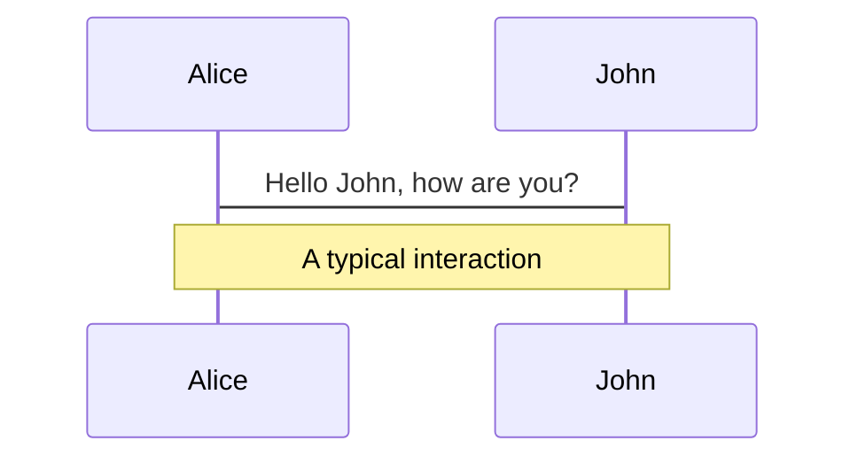
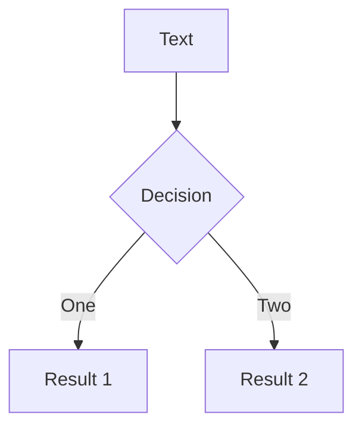
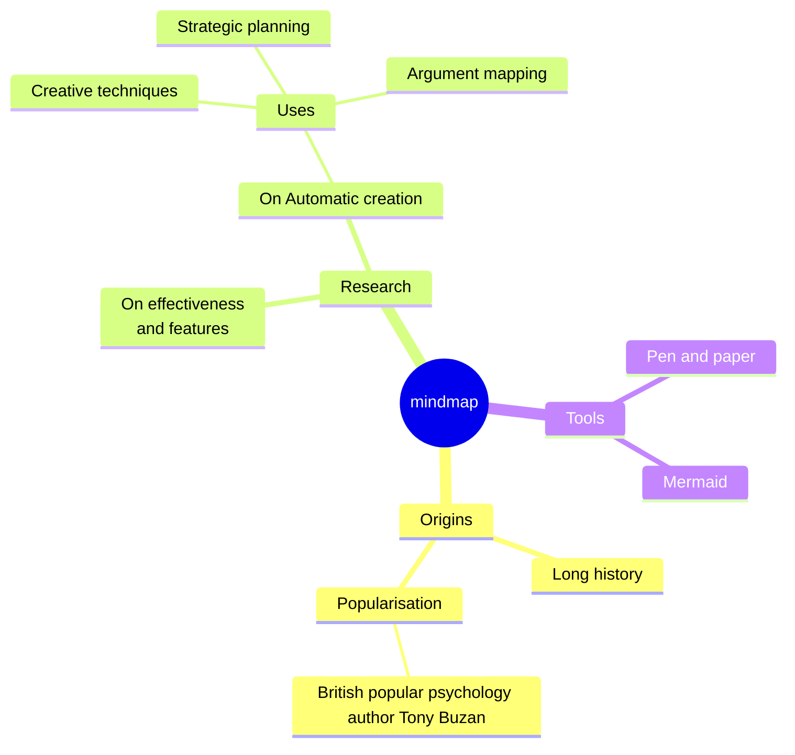
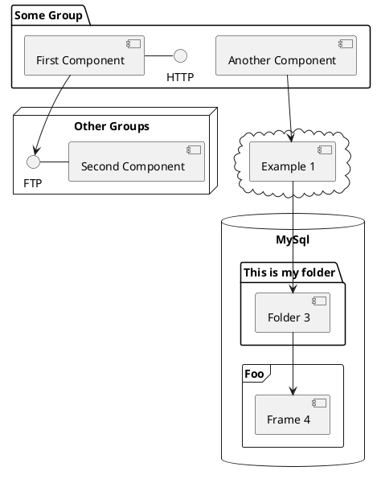

# SoEasy Network
## Empowering Global Resource Recycling Businesses <br/> with Verifiable Digital Ownership

SoEasy HK | 易收国际, 08/03/2025

---
layout: image-right
image: https://images.unsplash.com/photo-1534040385115-33dcb3acba5b?q=80&w=774&auto=format&fit=crop&ixlib=rb-4.1.0&ixid=M3wxMjA3fDB8MHxwaG90by1wYWdlfHx8fGVufDB8fHx8fA%3D%3D
---

## Our Vision
To be the global leader in digitalization, value creation, and internationalization of the resource recycling industry, empowering the construction of a resource-saving society through technology and achieving common environmental goals for humanity.

## Our Mission
Empowering global resource recycling businesses <br/> with **Verifiable Digital Ownership**

## SoEasy Network
SoEasy HK will serve as the global headquarters, overseeing global strategy and technology R&D. SoEasy China, as the first subsidiary, will leverage its decades of operation intelligence in the China market for global replication and empowerment.

---
layout: default
class: px-20
hide: false
---

# **The Unseen Challenge** (1/2)

<div grid="~ cols-2 gap-2" m="t-2">

**The Problem:** The global resource recycling industry, including critical sectors like **battery and lead recycling**, is hampered by **operational opacity, fragmented data, and a fundamental lack of trust.**

**The Barriers:** This creates significant **compliance hurdles** for operators, especially small and medium-sized enterprises (SMEs). It also **blocks their access to traditional financing** because they lack the verifiable operational data required by lenders.


</div>

Read more on [IEA (2024), Recycling of Critical Minerals, IEA, Paris](https://www.iea.org/reports/recycling-of-critical-minerals)

---
layout: image-right
image: https://assets.breakpoints.live/shubham-dhage-_rZnChsIFuQ-unsplash.jpg
---

# **The Unseen Challenge** (2/2)

- **Inefficient Capital Flow:** The traditional recycling industry suffers from slow capital turnover and limited funds, hindering large-scale development.
- **Opaque Value Assessment:** The true environmental value of recycled materials is difficult to quantify, leading to uneven value distribution across the supply chain.
- **Information Asymmetry:** Recycling data is fragmented, lacking unified standards and shared platforms, which impedes industry efficiency.
- **Insufficient Incentive Mechanisms:** Recycling participants (especially at the front-end) lack sufficient economic incentives, and their environmental enthusiasm needs to be improved.
- **Complex Cross-border Transactions:** International trade of recycled materials involves complex aspects such as multi-country regulations, payment settlements, and logistics.

---
layout: image-right
image: https://plus.unsplash.com/premium_photo-1682126334986-d3e22f992df2?q=80&w=1400&auto=format&fit=crop&ixlib=rb-4.1.0&ixid=M3wxMjA3fDB8MHxwaG90by1wYWdlfHx8fGVufDB8fHx8fA%3D%3D
---

# Data: The Untapped Asset

- **Industry Observation:** The traditional recycling industry has gone through three stages:
  - v1.0 - Individual struggle in data silo
  - v2.0 - Alliance cooperation, but with _Centralized Procurement Model_
  - v3.0 - Open Sharing, the emerging _Digital Certification Transformation_ era.

- **The Injustice:** In the v2.0 stage, practitioners and operators continuously created valuable data streams, but their ownership and economic benefits did not form an effective market and pricing system, and the creators did not receive due returns from the valuable data.

**“_We have the opportunity to drive industrial data from isolation to aggregation, and from aggregation to digital certification and value-added financing._”**

---
layout: default
class: px-20
hide: false
---

# SoEasy China v2.0 Proven Model

<div grid="~ cols-2 gap-2" m="t-2">

**Four-Flow Integration:** data flow, tax invoice flow, material flow, capital flow

**Rich Derivative Financing:** Collateralized lending, industry insurance, digitalization tools, tax certificate business, etc.


</div>

---
layout: image-right
image: https://assets.breakpoints.live/photo-network.png
hide: false
---

# SoEasy Network v3.0 Model
## Web3 Ownership: The Foundation of True Digital Ownership

**The Solution:** SoEasy Network addresses these industry challenges by building a **Decentralized Data Oracle and Market Network.**

**The Transformation:** We transform raw, fragmented operational data into **verifiable, auditable, and immutable digital assets**, creating a _Single Source of Truth_ for the entire industry.

---
layout: default
class: px-20
hide: false
---

# SoEasy Network v3.0 Model:
## Tokenomics + Gig Economy - Global Replication of SoEasy China's Operational Intelligence

<div grid="~ cols-2 gap-2" m="t-2">

**The Solution:** SoEasy Network helps global member institutions achieve the "Taxi Driver vs. Uber" model for their domestic resource recycling industry.

**The Transformation:** SoEasy China fulfills its responsibility as a genesis node member, accelerating the operational intelligence upgrade of the global resource recycling industry through SoEasy Network.


</div>

---
layout: image-right
image: https://images.unsplash.com/photo-1652533625932-25d5104161a1?q=80&w=774&auto=format&fit=crop&ixlib=rb-4.1.0&ixid=M3wxMjA3fDB8MHxwaG90by1wYWdlfHx8fGVufDB8fHx8fA%3D%3D
hide: false
---

# SoEasy Network v3.0 Solutions

- **RWA Integration:** Transform recycling data (e.g., recycling volume, types, environmental contributions) into quantifiable Real-World Assets (RWA), and anchor them with digital tokens via blockchain. These tokens represent the environmental value generated by recycling activities and future revenue rights.
- **Digital Token Incentives:** Reward data providers and recycling participants with digital tokens (points), realizing _data as asset_. The sustainable issuance mechanism of digital tokens will solve the problem of limited traditional funds, provide continuous financial support for the ecosystem, bringing in huge potential returns.
- **Global Unified Platform:** Establish a global recycling data trading and management platform to achieve data sharing, value transparency, and efficient circulation.
- **Empowerment Model:** SoEasy Network does not compete with existing recycling enterprises but empowers all participants in the industry chain, helping them convert their environmental contributions into **tradable carbon credit value**, achieving a win-win for all parties.
- **Efficient Cross-border Payments:** Provide blockchain-based cross-border payment services (PayFi), enabling T+0 settlement and lower fees, simplifying international trade processes.

---
layout: image-right
image: https://images.unsplash.com/photo-1652533625932-25d5104161a1?q=80&w=774&auto=format&fit=crop&ixlib=rb-4.1.0&ixid=M3wxMjA3fDB8MHxwaG90by1wYWdlfHx8fGVufDB8fHx8fA%3D%3D
---

# SoEasy Network v3.0 Solutions: Provenance & Trust, the Foundation of RWA

- **Data Integrity:** SoEasy Network ensures data integrity and auditability. We use On-Chain Proof Anchoring to secure the database state and require cryptographic signing for all events.

- **Verifiable Records:** Data is captured as Immutable Resource Event Records, cryptographically signed at the source. We will leverage Zero-Knowledge Proofs (ZKP) to ensure both integrity and commercial privacy.

- **Compliance-Ready:** This high-integrity data creates a trusted financial ledger, which is essential for developing automated tax compliance solutions and eliminating opaque transactions.

---
layout: image-right
image: https://assets.breakpoints.live/photo-network.png
hide: false
---

# SoEasy Business Model (1/3): Core Philosophy

SoEasy Network's core business model is to build an _Environmental Value Circular Ecosystem_ based on RWA and digital assets. Data providers (new energy equipment manufacturers, recycling companies, individual practitioners) integrate and synchronize anonymized data through operational tools to receive **token (point) rewards**.

These points can circulate and be traded within the platform, and cross-chain confirmation and transactions can be realized in the future. Through data mining and analysis, SoEasy Network will improve the efficiency and transparency of the entire recycling industry chain and ultimately convert environmental contributions into **tradable carbon assets**.

---
layout: image-right
image: https://assets.breakpoints.live/photo-network.png
hide: false
---

# SoEasy Business Model (2/3): RWA and Digital Tokens

- **Anchored Assets:** SoEasy Network's tokens are anchored to verified recycling data and the environmental contributions they represent (e.g., reduced carbon emissions, saved resources).
- **Value Capture:** As global attention to environmental protection and carbon emissions increases, and as the SoEasy Network platform expands in scale and accumulates data, the intrinsic value of digital tokens will continue to rise.
- **Funding Pool:** The sustainable issuance mechanism of digital tokens will build a self-sufficient funding pool, providing long-term impetus for SoEasy Network's operations and ecosystem incentives.

---
layout: image-right
image: https://assets.breakpoints.live/photo-network.png
hide: false
---

# SoEasy Business Model (3/3): Member Org Empowerment

- **Data Monetization:** Help recycling enterprises convert their daily operational data into quantifiable environmental value and receive digital token rewards.
- **Efficiency Improvement:** Optimize recycling processes and reduce operational costs through platform data analysis and intelligent matching.
- **Market Expansion:** Provide a global data and asset trading platform to help enterprises expand their business scope.
- **Carbon Trading Bridge:** Connect the environmental value generated by recycling with the future carbon trading market, creating additional revenue for enterprises.

---
layout: image-right
image: https://assets.breakpoints.live/photo-network.png
hide: false
---

# Market Analysis & Strategy (1/3): Target Markets
- **Initial Stage:** Focus on easily monetizable and highly market-oriented recycling categories, such as e-bikes' batteries, electric vehicle batteries, or power storage batteries.
- **Regional Expansion:** Scale up the proven China market operation, bootstrap the network, then gradually expand to emerging markets such as Southeast Asia, South Asia, the Middle East, Africa, and South America, finally entering developed markets like Europe and America, achieving global coverage.
- **Target Customers:** Recycling enterprises at all levels, individual recyclers, waste treatment plants, environmental organizations, carbon asset investors, and strategic investors focused on ESG.

---
layout: image-right
image: https://assets.breakpoints.live/photo-network.png
hide: false
---

# Market Analysis & Strategy (2/3): Competitive Advantages

- **Innovative Model:** Deep integration of RWA and blockchain technology, creating a new paradigm for value measurement in the global recycling industry.
- **Empowerment, Not Competition:** Collaborate with existing industry participants for mutual benefit, expanding the market pie together.
- **Global Vision:** Positioned for the global market from the outset, with China experience providing the foundation for global expansion.
- **Diversified Revenue:** Multiple profit points from data subscriptions, cross-border payments, asset issuance, and trading.
- **Social Value:** Addresses environmental issues, aligns with global sustainable development trends, and possesses unique social and brand awareness.

---
layout: image-right
image: https://assets.breakpoints.live/photo-network.png
hide: false
---

# Market Analysis & Strategy (3/3): Go-to-Market Strategy

- **Community & Builder First:** Establish active online and offline builders' communities to attract and educate _potential users, network participants, and investors_.
- **Industry Partnerships:** Establish strategic partnerships with local recycling associations, environmental organizations, and government agencies.
- **Technology Demonstration:** Launch successful cases to showcase SoEasy Network's capabilities in improving efficiency and creating value.
- **Customized Services:** Provide customized solutions for recycling needs in different regions and categories.
- **Branding:** Highlight SoEasy Network's _thought-leadership_ and _tech-leadership_ in environmental protection and sustainable development.

---
layout: image-right
image: https://images.unsplash.com/photo-1641580529558-a96cf6efbc72?q=80&w=1470&auto=format&fit=crop&ixlib=rb-4.1.0&ixid=M3wxMjA3fDB8MHxwaG90by1wYWdlfHx8fGVufDB8fHx8fA%3D%3D
---

# SoEasy Revenue Plan (1/3)
SoEasy Network is running at 3 Revenue Stages, forming a multi-layered and sustainable profit model:

## Stage 1 - Data Subscription & Transaction Fees
- **Source:** Data transaction volume and subscription service transaction fee commission % from platform member institutions.
- **Model:** Users (enterprises or institutions) pay subscription fees or transaction commissions based on their access, analysis, and transaction needs for recycling data.
- **Development:** As the number of users and data scale grow, this revenue will become SoEasy Network's foundation and stable cash flow.

---
layout: image-right
image: https://images.unsplash.com/photo-1641580529558-a96cf6efbc72?q=80&w=1470&auto=format&fit=crop&ixlib=rb-4.1.0&ixid=M3wxMjA3fDB8MHxwaG90by1wYWdlfHx8fGVufDB8fHx8fA%3D%3D
---

# SoEasy Revenue Plan (2/3)
SoEasy Network is running at 3 Revenue Stages, forming a multi-layered and sustainable profit model:

## Stage 2 - Cross-border PayFi Fees

- **Source:** Transaction service fees collected from blockchain-based cross-border payment services.
- **Model:** SoEasy Network provides international settlement services that are faster (T+0 settlement) and have lower fees (estimated 5% - 6%) than traditional banks, especially for international trade of recycled materials.
- **Development:** As SoEasy Network's global presence deepens and international trade partners increase, cross-border payments will bring substantial service revenue.

---
layout: image-right
image: https://images.unsplash.com/photo-1641580529558-a96cf6efbc72?q=80&w=1470&auto=format&fit=crop&ixlib=rb-4.1.0&ixid=M3wxMjA3fDB8MHxwaG90by1wYWdlfHx8fGVufDB8fHx8fA%3D%3D
---

# SoEasy Revenue Plan (3/3)
SoEasy Network is running at 3 Revenue Stages, forming a multi-layered and sustainable profit model:

## Stage 3 - Resource Recycling Asset Trading Services
- **Source:** Fees collected for helping global resource recycling enterprises issue their exclusive digital notifications and assets, and for facilitating the buying and selling of these digital assets.
- **Model:** SoEasy Network will build a **_irrevocable, non-transferable rights of participation platform_** to attract member orgs and investors who align with our values and investment return expectations, to participate in the issuance and trading of digital assets in the recycling industry.
- **Development:** This is the highest-value stage, representing its comprehensive capabilities and strength in the asset trading empowerment for the recycling industry.

---
layout: image-right
image: https://plus.unsplash.com/premium_photo-1675018587778-67888c112bd8?q=80&w=870&auto=format&fit=crop&ixlib=rb-4.1.0&ixid=M3wxMjA3fDB8MHxwaG90by1wYWdlfHx8fGVufDB8fHx8fA%3D%3D
---

# DAO Management Team

- **Board Director:**, _Jinsong Li_, Founder of SoEasy Group, proposer of core strategic ideas. Possesses profound insights into business model innovation, RWA integration, and globalization strategy.
- **DAO Admin Members:**
  - **Chance Jiang:** CEO, SoEasy HK. Proficient in blockchain technology and crypto-economics, marketing and business development, and responsible for core data platform product and engineering R&D.
  - **Emily Luo:** COO, SoEasy HK. Proficient in recycling industry operations and management, international trade and cross-border payments, legal compliance, and fund management.
  - **Jane Zheng:** CMO, SoEasy HK. Proficient in technology and product community operations, marketing and business development.

---
layout: image-right
image: https://images.unsplash.com/photo-1593672715438-d88a70629abe?q=80&w=987&auto=format&fit=crop&ixlib=rb-4.1.0&ixid=M3wxMjA3fDB8MHxwaG90by1wYWdlfHx8fGVufDB8fHx8fA%3D%3D
---

# Fund Raise & Equity Offer (1/2)

- **Seed Round Funding Amount:**
  - Raising $13.7 million USD for 20% equity tokens
  - Initial valuation at $68.6 million USD

- **Use of Funds:**
  - **Market Promotion and Global Expansion:** Cover market marketing, channel building, localized operations, and partner expansion in different regions.
  - **Compliance and Legal:** Ensure global operations comply with local laws and regulations.
  - **Operating Capital:** Funds required to maintain daily operations.

---
layout: image-right
image: https://images.unsplash.com/photo-1593672715438-d88a70629abe?q=80&w=987&auto=format&fit=crop&ixlib=rb-4.1.0&ixid=M3wxMjA3fDB8MHxwaG90by1wYWdlfHx8fGVufDB8fHx8fA%3D%3D
---

# Fund Raise & Equity Offer (2/2)

- **Use of Funds:**
  - **Market Promotion and Global Expansion:** Cover market marketing, channel building, localized operations, and partner expansion in different regions.
  - **Compliance and Legal:** Ensure global operations comply with local laws and regulations.
  - **Operating Capital:** Funds required to maintain daily operations.

- Refer to _SoEasy Revenue Plan_ for revenue modeling and key metrics.
- During investment talks, we'll provide you with more detail upon requests, such as revenue, costs, profits, and cash flow.

---
layout: image-left
image: https://images.unsplash.com/photo-1579621970343-21c491b3f363?q=80&w=774&auto=format&fit=crop&ixlib=rb-4.1.0&ixid=M3wxMjA3fDB8MHxwaG90by1wYWdlfHx8fGVufDB8fHx8fA%3D%3D
---

# Investment Highlights

- **Huge Market Potential:** The global recycling industry is vast and growing rapidly; digitalization and value creation are inevitable trends.
- **Disruptive Innovation:** RWA and blockchain integration creates a new landscape for the recycling industry, addressing industry pain points.
- **Unique Empowerment Model:** Win-win with the industry, building a sustainable ecosystem.
- **Social and Environmental Value:** Actively responds to global environmental calls, possessing strong social influence.
- **Globalization Strategy:** Based on successful Chinese experience, benefiting global franchise institutions and markets.
- **Diversified Revenue:** Multi-layered profit model, ensuring long-term stable growth.

---
layout: image-right
image: https://images.unsplash.com/photo-1519599189038-58e6fc7a060d?q=80&w=928&auto=format&fit=crop&ixlib=rb-4.1.0&ixid=M3wxMjA3fDB8MHxwaG90by1wYWdlfHx8fGVufDB8fHx8fA%3D%3D
---

# Risks Disclaimer

- **Technology Risk:** Rapid technological development requires continuous investment in R&D to maintain leadership.
- **Market Risk:** Market education and user habit cultivation for new models require time.
- **Regulatory Risk:** Digital asset and blockchain regulatory policies vary globally and are still unclear; close attention and compliance are required.
- **Competition Risk:** New competitors or existing giants may enter the market.
- **Execution Risk:** Global expansion involves challenges such as cultural differences and localized operations.

---
layout: default
---

# Prosperity Through Clear Property Rights

- **Vision:** SoEasy Network aims to bring transparency, efficiency, and trust to the global resource recycling industry as a **core technological infrastructure**, empowering global peer organizations.

- **Pathway:**
  - We have launched _Tech for Social Good_ international Sustainable Development Goals (SDG) proof-of-concept projects, _Project Volta_.
  - We are following the path of **IP/Brand Assets > RWA/Digital Assets > IPO/Financial Assets** to raise global franchise/staking node operators.

- **Core Principles:**
  - History has proven the inseparable link between **clear property rights and industrial prosperity.** We bring this principle in building SoEasy Network, ensuring that local market stakeholders have true digital ownership and control over their valuable recycling data.
  - **ESG Value**
    - Individuals gain stable employment opportunities and income, promoting full employment;
    - Enhanced opportunities for career development and skill improvement;
    - Promote sustainable development and environmental protection.

---
layout: image-right
image: https://images.unsplash.com/photo-1534040385115-33dcb3acba5b?q=80&w=774&auto=format&fit=crop&ixlib=rb-4.1.0&ixid=M3wxMjA3fDB8MHxwaG90by1wYWdlfHx8fGVufDB8fHx8fA%3D%3D
---

# Investor Inquiry

<br/><br/><br/>
## _**Chance Jiang**_, CEO, SoEasy HK<br/>
#### chance@teb.network <br/>


---
layout: image-right
image: https://assets.breakpoints.live/joel-vodell-8Ogfqvw15Rg-unsplash-small.jpg
---
<br/>

# 易收国际平台 | SoEasy Network
**用数字确权推动全球再生资源共识和产业发展**

SoEasy HK | 易收国际, 08/03/2025

---
layout: image-right
image: https://images.unsplash.com/photo-1534040385115-33dcb3acba5b?q=80&w=774&auto=format&fit=crop&ixlib=rb-4.1.0&ixid=M3wxMjA3fDB8MHxwaG90by1wYWdlfHx8fGVufDB8fHx8fA%3D%3D
---

## 「易收国际」愿景
成为全球再生资源产业数字化、价值化和国际化的引领者，通过技术赋能推动构建节约型社会，实现人类共同的环保目标。

## 「易收国际」使命
用数字确权推动全球再生资源共识和产业发展

## 「易收国际」
易收国际（SoEasy HK）将作为全球总部，统筹全球战略与技术研发；
易收中国（SoEasy China）作为首个子公司，将基于中国市场积累的经验和模式，向全球复制推广。


---
layout: default
class: px-20
hide: false
---

# **资源再生未被看见的挑战** (1/2)

<div grid="~ cols-2 gap-2" m="t-2">

**问题所在：** 全球再生资源行业，包括**电池和铅回收**等关键领域，长期受困于**运营不透明、数据碎片化和信任缺失**。

**发展障碍：** 这为运营商，特别是中小企业 (SME)，带来了巨大的**合规障碍**。由于缺乏可验证的运营数据，他们也**难以获得传统金融机构的融资支持**。


</div>

<!--
 在现代经济中，数据是我们身份和工作的核心部分。然而，在传统的回收行业，运营商对自己产生的宝贵数据没有真正的所有权。他们的数字记录和交易历史可以随时被中心化平台修改或删除，使他们无法掌控自己的数字足迹。

 （铺垫范式转移的机会）
 加入例子：传统行业缺乏数字化运营能力，传统靠人的判断，是买方市场，但数据的缺失导致了信息不对称和不公平竞争。这部分有巨大的提效增值空间。为解决这个行业问题，构建数据平台服务市场参与者并给予他们经济回报。例如，一家小型电池回收商可能无法准确评估其库存价值，因为缺乏标准化的数据格式和共享机制。
 (铺垫联网数据的价值，联网数据的价值在于它能够提供透明度和可追溯性，帮助运营商更好地管理其业务，提高效率和盈利能力。)

 -->

---
layout: image-right
image: https://assets.breakpoints.live/shubham-dhage-_rZnChsIFuQ-unsplash.jpg
---

# **资源再生未被看见的挑战** (2/2)

- **资金流转效率低：** 传统回收行业资金周转慢，资金量受限，难以支撑规模化发展。
- **价值评估不透明：** 回收物的真实环保价值难以量化，导致产业链上下游价值分配不均。
- **信息不对称：** 回收数据分散，缺乏统一标准和共享平台，阻碍行业效率提升。
- **激励机制不足：** 回收参与者（尤其是前端）缺乏足够的经济激励，环保积极性有待提高。
- **跨境交易复杂：**  国际回收物资交易涉及多国法规、支付结算和物流等复杂环节。

<!--
讲解要点
-->

---
layout: image-right
image: https://plus.unsplash.com/premium_photo-1682126334986-d3e22f992df2?q=80&w=1400&auto=format&fit=crop&ixlib=rb-4.1.0&ixid=M3wxMjA3fDB8MHxwaG90by1wYWdlfHx8fGVufDB8fHx8fA%3D%3D
---

# **数据：尚未开发的资产**

- **产业观察：** 传统回收行业经历了三个阶段：
  - v1.0 - 单打独斗
  - v2.0 - 联盟合作（集采模式）
  - v3.0 - 开放共享（数证化转型）。

- **不公之处：** v2.0 阶段从业者和运营商持续不断地创造着宝贵的数据流，但其所有权和经济利益没有形成有效市场和价格体系，创造者并未从可估值到数据中获得应有的回报。

「我们有机会驱动产业数据从孤立到聚合、从聚合到数证化共享。」

<!--
每一笔回收交易、每一次物流运输和每一个处理环节都产生了海量的运营和财务数据。这些信息是优化供应链、创建实体资产通证化 (RWA) 项目、确保税务合规以及构建新型金融服务的金矿。然而，创造这些数据的企业却被隔绝在其巨大的价值之外。
-->

---
layout: default
class: px-20
hide: false
---

# 易收中国 v2.0 已验证模式

<div grid="~ cols-2 gap-2" m="t-2">

**四流合一：** 数据流、税票流、物资流、资金流

**丰富的衍生金融服务：** 金融助贷、产业保险、数字化工具、稅证业务等


</div>

---
layout: image-right
image: https://assets.breakpoints.live/photo-network.png
hide: false
---

# 易收国际 v3.0 模式
## Web3 确权：真正数字所有权的基础

**解决方案：** SoEasy Network 通过构建一个**去中心化的数据预言机（Data Oracle）和市场网络（Market Network）**，来解决这些行业挑战。

**行业变革：** 我们将原始、碎片化的运营数据转化为**可验证、可审计且不可篡改的数字资产**，为整个行业打造一个单一事实来源 (Single Source of Truth)。

<!--
SoEasy Network 旨在将数字所有权革命带入再生资源行业。我们正在构建一个能够服务全球回收企业的去中心化数据市场。通过将实体运营与去中心化金融 (DeFi) 相连接，我们实现了透明且可验证的实体资产 (RWA) 管理，确保每一个真实的业务行为都能在区块链上拥有一个可信的数字记录。
-->

---
layout: default
class: px-20
hide: false
---

# 易收国际 v3.0 模式：通证经济 + 零工经济
## 全球复制易收中国的运营智能

<div grid="~ cols-2 gap-2" m="t-2">

**解决方案：** 易收国际帮助全球成员机构实现本国资源回收行业的「出租车司机 vs. Uber」模式

**行业变革：** 易收中国履行创世节点成员的责任，通过 SoEasy Network 加速全球资源回收行业的运营智能升级。


</div>

<!--
SoEasy Network 旨在将数字所有权革命带入再生资源行业。我们正在构建一个能够服务全球回收企业的去中心化数据市场。通过将实体运营与去中心化金融 (DeFi) 相连接，我们实现了透明且可验证的实体资产 (RWA) 管理，确保每一个真实的业务行为都能在区块链上拥有一个可信的数字记录。
-->

---
layout: image-left
image: https://assets.breakpoints.live/photo-network.png
hide: false
---

# 易收国际 v3.0 解决方案

- **RWA融合：** 将回收数据（如回收量、种类、环保贡献等）转化为可量化的真实世界资产（RWA），并通过区块链技术发行相应的数字通证。这些通证代表了回收行为产生的环保价值和未来收益权。
- **数字通证激励：** 通过数字通证（积分）奖励数据提供者和回收参与者，实现「数据即财富」。数字通证的可持续发行机制，将解决传统资金有限的问题，为生态系统提供源源不断的资金支持，并赋予参与者巨大的潜在收益空间。
- **全球统一平台：** 建立全球化的回收数据交易与管理平台，实现数据共享、价值透明化和高效流通。
- **赋能模式：** 易收不与现有回收企业竞争，而是赋能所有产业链参与者，帮助他们将其环保贡献转化为可交易的碳交易价值，实现多方共赢。
- **高效跨境支付：** 提供基于区块链技术的跨境支付服务（PayFi），实现 T+0 到账和更低费率，简化国际贸易流程。

---
layout: image-right
image: https://images.unsplash.com/photo-1641580529558-a96cf6efbc72?q=80&w=1470&auto=format&fit=crop&ixlib=rb-4.1.0&ixid=M3wxMjA3fDB8MHxwaG90by1wYWdlfHx8fGVufDB8fHx8fA%3D%3D
---

# 易收国际 v3.0 解决方案：
## 溯源与信任：资产通证化 (RWA) 的基石

- **数据完整性：** **易收国际平台 / SoEasy Network** 确保数据完整性和可审计性。我们使用_链上证明锚定_来保障数据库状态，并要求所有事件进行加密签名。

- **可验证记录：** 数据被捕获为**不可变资源事件记录**，并在源头进行加密签名。我们将利用零知识证明（ZKP）来确保完整性和商业隐私。

- **合规就绪：** 这种高完整性数据创建了一个可信的财务账本，这对于开发**自动化税务合规解决方案**和消除不透明交易至关重要。

<!--
数字权利之争取决于溯源。当 Getty Images 起诉一位 AI 创作者时，是因为他们能证明其图片未经许可被使用。区块链解决了数字财产的溯源问题。这对于可再生资源行业至关重要，因为可追溯性和信任是其全部。我们的系统将原始数据转化为可验证的财务记录，满足最严格的合规要求，同时利用 ZKP 保护敏感的商业数据。
-->

---
layout: image-right
image: https://assets.breakpoints.live/photo-network.png
hide: false
---

# 易收国际商业模式（1/3）

## 核心理念：
易收的核心商业模式是构建一个基于 RWA 和数字资产的「环保价值循环生态系统」。数据提供者（新能源装备制造企业、回收企业、从业者个人）透过运营工具集成同步脱敏数据，获得数字通证（积分）奖励。这些积分可以在平台内流通、交易，未来可实现跨链确认和交易。通过数据挖掘和分析，易收将提升整个回收产业链的效率和透明度，并最终将环保贡献转化为可交易的碳资产。

---
layout: image-right
image: https://assets.breakpoints.live/photo-network.png
hide: false
---

# 易收国际商业模式（2/3）
## RWA 与数字通证：

- **锚定资产：** 易收的数字通证锚定的是经过验证的回收数据和其所代表的环保贡献（如减少的碳排放量、节约的资源等）。
- **价值捕获：** 随着全球对环保和碳排放的重视，以及易收平台规模的扩大和数据的积累，数字通证的内在价值将不断提升。
- **资金池：** 数字通证的可持续发行机制，将构建一个自给自足的资金池，为易收的运营和生态激励提供长期动力。

---
layout: image-right
image: https://assets.breakpoints.live/photo-network.png
hide: false
---

# 易收国际商业模式（3/3）
## 赋能机制：

- **数据变现：** 帮助回收企业将其日常运营数据转化为可量化的环保价值，并获得数字通证奖励。
- **效率提升：** 通过平台的数据分析和智能匹配，优化回收流程，降低运营成本。
- **市场拓展：** 提供一个全球性的数据和资产交易平台，帮助企业拓展业务范围。
- **碳交易桥梁：** 将回收产生的环保价值与未来的碳交易市场连接起来，为企业创造额外收入。

---
layout: image-left
image: https://assets.breakpoints.live/photo-network.png
hide: false
---

# 市场分析与战略（1/3）
## 目标市场：
- **初期阶段：** 重点聚焦易于变现且市场化程度较高的回收品类，如废塑料和废纸。
- **区域拓展：** 首先规模化已验证的中国市场运营模式，构建国际数据和工具平台，随后逐步推广至东南亚、南亚、中东、非洲、南美等新兴市场，最后进入欧美等发达市场，实现全球化覆盖。
- **目标客户：** 各级回收企业、个体回收商、垃圾处理厂、环保机构、碳资产投资者、关注ESG的战略投资者。

---
layout: image-left
image: https://assets.breakpoints.live/photo-network.png
hide: false
---

# 市场分析与战略（2/3）
## 竞争优势：

- **创新模式：** RWA与区块链技术的深度融合，开创了回收行业价值量化的新范式。
- **赋能而非竞争：** 与现有行业参与者合作共赢，共同做大市场蛋糕。
- **全球化视野：** 从一开始就定位全球市场，中国经验为全球拓展提供基础。
- **多元化营收：** 数据订阅、跨境支付、资产发行与交易等多重盈利点。
- **社会价值：** 解决环境问题，符合全球可持续发展趋势，具有独特的社会和品牌号召力。

---
layout: image-left
image: https://assets.breakpoints.live/photo-network.png
hide: false
---

# 市场分析与战略（3/3）
## 市场推广策略：

- **开发者与加盟社群建设：** 建立活跃的线上线下开发者与加盟机构社群，吸引和教育潜在用户和投资者。
- **行业合作：** 与各地的回收协会、环保组织、政府机构建立战略合作关系。
- **技术示范：** 推出成功案例，展示易收平台在提升效率和创造价值方面的能力。
- **定制化服务：** 针对不同区域和品类的回收需求，提供定制化的解决方案。
- **品牌建设：** 突出易收在环保和可持续发展领域的领导者形象。

---
layout: image-right
image: https://images.unsplash.com/photo-1534413298607-48ba59e8a06d?q=80&w=1470&auto=format&fit=crop&ixlib=rb-4.1.0&ixid=M3wxMjA3fDB8MHxwaG90by1wYWdlfHx8fGVufDB8fHx8fA%3D%3D
hide: true
---

# **所有权如何驱动经济自由与价值**

- **赋能：** **对已验证数据的所有权**赋予了参与者真正的经济自由，包括自由交易的权利和从强大的**网络效应**中获益的能力。

- **全新路径：** 将回收数据通证化为 **RWA 代币**，为所有生态参与者开辟了前所未有的融资、交易和投资渠道。

- **价值发现：** RWA 项目提供了一种强大的**基于市场的融资和估值机制**，帮助企业在传统 IPO 之前建立其真实的市场价值。

<!--
这一模式直接适用于 `Soeasy Network`。通过将实体回收数据通证化，企业可以发行代表其运营价值的 RWA 代币。这为企业获取资本创造了机会，也为投资者提供了接触标的资产表现的渠道。平台使运营和收入透明化、可审计化的能力，为建立可信的 IPO 前估值奠定了信任基础。
-->

---
layout: default
hide: true
---

# **驱动全球再生资源生态的经济引擎**

- **经济引擎：** 原生 **SEN 代币** 是易收国际平台生态系统的经济引擎。

- **效用：** 它作为我们去中心化市场中**数据交易的主要“记账单位”**。数据验证、访问和高级服务的费用均以 SEN 支付。

- **激励：** **代币奖励机制** 激励数据提供者完整、及时地贡献高质量、可验证的数据。

- **质押与治理：** 参与者可以质押 SEN 以帮助保护网络安全、访问高级功能并参与**去中心化治理**。
  - 易收中国作为**第一个创世节点**来保障网络安全
  - 以及其他由早期资源再生业务伙伴运营的成员节点

<!--
SEN 代币的价值与平台的采用及其内部数据的效用息息相关。这种模式确保了那些贡献有价值运营数据的人得到直接奖励，从而培育一个强大、自我维持的生态系统，其中所有参与者都从集体努力中受益。
-->

---
layout: image-left
image: https://assets.breakpoints.live/shubham-dhage-_rZnChsIFuQ-unsplash.jpg
hide: true
---

# **去中心化治理与通证经济学** (1/2)

- **新范式：** 这代表了从传统**股东资本主义**向**利益相关者通证经济学**的根本性转变，其中每个参与者——从最小的回收门店到最大的投资者——都成为所有者和决策者。

- **社区控制：** **SoEasy Network** 被设计为一个**去中心化自治组织 (DAO)**，未来的治理将由 SEN 代币持有者管理，即全球各地的参与成员，其中易收中国作为创始成员和创世数据节点。

- **成熟区块链技术：** 我们利用成熟的区块链技术，如 SPL 治理标准，来实现灵活且安全的利益相关者通证经济学控制。


---
layout: image-right
image: https://assets.breakpoints.live/shubham-dhage-_rZnChsIFuQ-unsplash.jpg
hide: true
---

# **去中心化治理与通证经济学** (2/2)

- **用易收国际平台孵化您的回收业务：**
  - **易收国际平台 / SoEasy Network** 将孵化全球回收业务，以少数初始股权开始。
  - 随着时间推移，**易收国际平台**的股权将分散给本地利益相关者，确保新成员业务的公平和可持续增长。

- **创世节点作为初始运营智能提供者：**
  - **易收中国**作为创世节点，正通过 AI 代理以其不断增长的运营智能赋能**新成员公司**，以升级或优化其本地运营。
  - 随着可再生能源系统采纳的增加，各国将从易收国际平台的参与中受益最多，以实现其 SDG 和经济目标。

<!--
我们对 `Soeasy Network` 的愿景是一个全球生态系统，参与者在此共同建设、共同分享、共同获胜。通过代币激励和智能合约，我们量化并奖励贡献，确保所有利益相关者保持一致，并对网络的成功拥有既得利益。这种模式使我们能够促进本地所有权和市场验证，这在我们在泰国建立运营的方针中得到了体现。
-->

---
layout: image-right
image: https://images.unsplash.com/photo-1641580529558-a96cf6efbc72?q=80&w=1470&auto=format&fit=crop&ixlib=rb-4.1.0&ixid=M3wxMjA3fDB8MHxwaG90by1wYWdlfHx8fGVufDB8fHx8fA%3D%3D
---

# 易收国际营收规划（1/3）
易收国际营收将分为三个发展阶段，形成多层次可持续的盈利模式：

## 阶段一：数据订阅市场交易费
- **来源：** 平台成员机构的数据交易量和订阅服务交易费佣金 %。
- **模式：** 用户（企业或机构）根据其对回收数据的访问、分析和交易需求支付订阅费或交易佣金。高质量、实时更新的回收数据将成为平台的核心资产。
- **发展：** 随着用户数量和数据规模的增长，此项收入将成为易收的基础和稳定现金流。

---
layout: image-right
image: https://images.unsplash.com/photo-1641580529558-a96cf6efbc72?q=80&w=1470&auto=format&fit=crop&ixlib=rb-4.1.0&ixid=M3wxMjA3fDB8MHxwaG90by1wYWdlfHx8fGVufDB8fHx8fA%3D%3D
---

# 易收国际营收规划（2/3）
易收国际营收将分为三个发展阶段，形成多层次可持续的盈利模式：

## 阶段二：跨境支付（PayFi）服务费

- **来源：** 基于区块链技术的跨境支付服务所收取的交易服务费。
- **模式：** 易收提供比传统银行更快速（T+0到账）、费率更低（预计 5% - 6%）的国际结算服务，尤其针对回收物资的国际贸易。
- **发展：** 随着易收全球化布局的深入和国际贸易伙伴的增加，跨境支付将带来可观的服务收入。

---
layout: image-right
image: https://images.unsplash.com/photo-1641580529558-a96cf6efbc72?q=80&w=1470&auto=format&fit=crop&ixlib=rb-4.1.0&ixid=M3wxMjA3fDB8MHxwaG90by1wYWdlfHx8fGVufDB8fHx8fA%3D%3D
---

# 易收国际营收规划（3/3）
易收国际营收将分为三个发展阶段，形成多层次可持续的盈利模式：

## 阶段三：再生资源资产交易服务

- **来源：** 帮助全球资源回收企业发行其专属的数字通知和资产，以及促成这些数字资产的买卖所收取的手续费。
- **模式：** 易收将搭建一个类似「俱乐部」的平台，吸引符合易收价值观和投资回报预期的机构和个人投资者，参与回收产业数字资产的发行与交易。
- **发展：** 这是易收最高层级的收入来源，代表了其在回收产业金融化和资产证券化方面的综合能力和实力。通过赋能实体企业发行数字资产，易收将成为连接真实世界环保贡献与数字资本市场的关键枢纽。

---
layout: image-right
image: https://images.unsplash.com/photo-1641580529558-a96cf6efbc72?q=80&w=1470&auto=format&fit=crop&ixlib=rb-4.1.0&ixid=M3wxMjA3fDB8MHxwaG90by1wYWdlfHx8fGVufDB8fHx8fA%3D%3D
---

# 管理团队

- 李劲松：易收集团创始人，核心战略思想提出者。在商业模式创新、RWA 融合和全球化战略方面具有深远洞察力。
- 核心团队成员：
  - Chance Jiang，CEO，SoEasy HK，擅长区块链技术与加密经济、市场营销与业务拓展，同时负责核心数据平台产品和工程技术研发
  - Emily Luo，COO，SoEasy HK，擅长回收产业运营与管理、国际贸易与跨境支付，法律合规与基金管理
  - Jane Zheng，CMO，SoEasy HK，擅长技术和产品社区运营，市场营销与业务拓展

---
layout: image-right
image: https://images.unsplash.com/photo-1593672715438-d88a70629abe?q=80&w=987&auto=format&fit=crop&ixlib=rb-4.1.0&ixid=M3wxMjA3fDB8MHxwaG90by1wYWdlfHx8fGVufDB8fHx8fA%3D%3D
---

# 融资与财务（1/2）

- **种子轮融资额：**
  - 融资 1 亿 RMB，出让 20% 股权，估值 5 亿 RMB
- **资金用途：**
  - **技术研发与维护：** 持续投入区块链技术、数据分析、AI等核心技术的研发，确保平台领先性。
  - **团队建设与人才引进：** 吸引全球顶尖的技术、运营、市场和管理人才。
  - **市场推广与全球拓展：** 覆盖不同区域的市场营销、渠道建设、本地化运营和合作伙伴拓展。
  - **合规与法务：** 确保全球范围内的运营符合当地法律法规。
  - **运营资本：** 维持日常运营所需资金。

---
layout: image-right
image: https://images.unsplash.com/photo-1593672715438-d88a70629abe?q=80&w=987&auto=format&fit=crop&ixlib=rb-4.1.0&ixid=M3wxMjA3fDB8MHxwaG90by1wYWdlfHx8fGVufDB8fHx8fA%3D%3D
---

# 融资与财务（2/2）

- 参考「易收国际营收规划」了解我们的营收发展阶段模型和关键指标。
- 投资沟通中，我们将提供更详细的信息，包括收入、成本、利润和现金流等关键指标。

---
layout: image-left
image: https://images.unsplash.com/photo-1579621970343-21c491b3f363?q=80&w=774&auto=format&fit=crop&ixlib=rb-4.1.0&ixid=M3wxMjA3fDB8MHxwaG90by1wYWdlfHx8fGVufDB8fHx8fA%3D%3D
---

# 投资亮点

- **市场潜力巨大：** 全球回收产业规模庞大且增长迅速，数字化和价值化是必然趋势。
- **颠覆性创新：** RWA与区块链融合，开创回收产业新格局，解决行业痛点。
- **独特赋能模式：** 与行业共赢，构建可持续发展的生态系统。
- **社会与环境价值：** 积极响应全球环保号召，具有强大的社会影响力。
- **全球化战略：** 基于中国成功经验，惠及全球加盟机构和市场。
- **多元化收入：** 多层次盈利模式，确保长期稳定增长。

---
layout: image-right
image: https://images.unsplash.com/photo-1519599189038-58e6fc7a060d?q=80&w=928&auto=format&fit=crop&ixlib=rb-4.1.0&ixid=M3wxMjA3fDB8MHxwaG90by1wYWdlfHx8fGVufDB8fHx8fA%3D%3D
---

# 风险提示

- **技术风险：** 技术发展迅速，需持续投入研发以保持领先。
- **市场风险：** 新模式的市场教育和用户习惯培养需要时间。
- **监管风险：** 全球各地对数字资产和区块链的监管政策尚不明朗，需密切关注并保持合规。
- **竞争风险：** 可能出现新的竞争对手或现有巨头进入。
- **执行风险：** 全球化拓展涉及文化差异、本地化运营等挑战。

---
layout: default
---

# 展望：以产权创繁荣，赋能 SDG/ESG 发展

- **愿景：** **SoEasy Network** 旨在为全球再生资源行业提供**核心技术基础设施**，带来透明度、效率和信任，赋能全球市场。

- **路径：**
  - 我们已启动「科技向善」SDG 项目：Project Volta，「捐助新能源智能厨具套件给美食创业者」
  - 我们正沿着 **IP/品牌资产 > RWA/数字资产 > IPO/金融资产** 的路径，招募全球节点运营商。

- **核心原则：**
  - 我们将**清晰产权与产业繁荣**的引入资源再生世界市场，「以恒产促恒心」赋能本地运营商。
  - **ESG 价值**：促进就业与收入，提升职业发展，推动可持续发展与环境保护。

易收国际致力于通过将回收数据转化为可交易的数字资产，彻底改变传统回收行业，为所有参与者创造新价值，并为构建更绿色、高效的全球经济做出贡献。我们诚邀志同道合的投资者加入，共同开启这场赋能全球回收产业的创新之旅。

<!--
乔治·华盛顿曾写道：‘自由与财产权密不可分。’ 这句话同样适用于虚拟世界。为了确保我们的数字自由——使我们不成为平台或未来人工智能的奴隶——我们必须拥有真正的数字产权。通过为再生资源建立这些权利，SoEasy Network 正在为所有人构建一个更公平、更透明、更繁荣的全球经济，与全球关键市场的强大本地合作和所有权开始。
-->

---
layout: image-right
image: https://images.unsplash.com/photo-1534040385115-33dcb3acba5b?q=80&w=774&auto=format&fit=crop&ixlib=rb-4.1.0&ixid=M3wxMjA3fDB8MHxwaG90by1wYWdlfHx8fGVufDB8fHx8fA%3D%3D
---

# 投资咨询联系人

<br/><br/><br/>
## _**Chance Jiang**_, CEO, SoEasy HK<br/>
#### chance@teb.network <br/>


---
transition: fade-out
hide: true
---

# What is Slidev?

Slidev is a slides maker and presenter designed for developers, consist of the following features

- 📝 **Text-based** - focus on the content with Markdown, and then style them later
- 🎨 **Themable** - themes can be shared and re-used as npm packages
- 🧑‍💻 **Developer Friendly** - code highlighting, live coding with autocompletion
- 🤹 **Interactive** - embed Vue components to enhance your expressions
- 🎥 **Recording** - built-in recording and camera view
- 📤 **Portable** - export to PDF, PPTX, PNGs, or even a hostable SPA
- 🛠 **Hackable** - virtually anything that's possible on a webpage is possible in Slidev
<br>
<br>

Read more about [Why Slidev?](https://sli.dev/guide/why)

<!--
You can have `style` tag in markdown to override the style for the current page.
Learn more: https://sli.dev/features/slide-scope-style
-->

<style>
h1 {
  background-color: #2B90B6;
  background-image: linear-gradient(45deg, #4EC5D4 10%, #146b8c 20%);
  background-size: 100%;
  -webkit-background-clip: text;
  -moz-background-clip: text;
  -webkit-text-fill-color: transparent;
  -moz-text-fill-color: transparent;
}
</style>

<!--
Here is another comment.
-->

---
transition: slide-up
level: 2
hide: true
---

# Navigation

Hover on the bottom-left corner to see the navigation's controls panel, [learn more](https://sli.dev/guide/ui#navigation-bar)

## Keyboard Shortcuts

|                                                     |                             |
| --------------------------------------------------- | --------------------------- |
| <kbd>right</kbd> / <kbd>space</kbd>                 | next animation or slide     |
| <kbd>left</kbd>  / <kbd>shift</kbd><kbd>space</kbd> | previous animation or slide |
| <kbd>up</kbd>                                       | previous slide              |
| <kbd>down</kbd>                                     | next slide                  |

<!-- https://sli.dev/guide/animations.html#click-animation -->

<p v-after class="absolute bottom-23 left-45 opacity-30 transform -rotate-10">Here!</p>

---
layout: two-cols
layoutClass: gap-16
hide: true
---

# Table of contents

You can use the `Toc` component to generate a table of contents for your slides:

```html
<Toc minDepth="1" maxDepth="1" />
```

The title will be inferred from your slide content, or you can override it with `title` and `level` in your frontmatter.

::right::

<Toc text-sm minDepth="1" maxDepth="2" />

---
layout: image-right
image: https://cover.sli.dev
hide: true
---

# Code

Use code snippets and get the highlighting directly, and even types hover!

```ts [filename-example.ts] {all|4|6|6-7|9|all} twoslash
// TwoSlash enables TypeScript hover information
// and errors in markdown code blocks
// More at https://shiki.style/packages/twoslash
import { computed, ref } from 'vue'

const count = ref(0)
const doubled = computed(() => count.value * 2)

doubled.value = 2
```

<arrow v-click="[4, 5]" x1="350" y1="310" x2="195" y2="342" color="#953" width="2" arrowSize="1" />

<!-- This allow you to embed external code blocks -->

<!-- Footer -->

[Learn more](https://sli.dev/features/line-highlighting)

<!-- Inline style -->
<style>
.footnotes-sep {
  @apply mt-5 opacity-10;
}
.footnotes {
  @apply text-sm opacity-75;
}
.footnote-backref {
  display: none;
}
</style>

<!--
Notes can also sync with clicks

[click] This will be highlighted after the first click

[click] Highlighted with `count = ref(0)`

[click:3] Last click (skip two clicks)
-->

---
level: 2
hide: true
---

# Shiki Magic Move

Powered by [shiki-magic-move](https://shiki-magic-move.netlify.app/), Slidev supports animations across multiple code snippets.

Add multiple code blocks and wrap them with <code>````md magic-move</code> (four backticks) to enable the magic move. For example:

````md magic-move {lines: true}
```ts {*|2|*}
// step 1
const author = reactive({
  name: 'John Doe',
  books: [
    'Vue 2 - Advanced Guide',
    'Vue 3 - Basic Guide',
    'Vue 4 - The Mystery'
  ]
})
```

```ts {*|1-2|3-4|3-4,8}
// step 2
export default {
  data() {
    return {
      author: {
        name: 'John Doe',
        books: [
          'Vue 2 - Advanced Guide',
          'Vue 3 - Basic Guide',
          'Vue 4 - The Mystery'
        ]
      }
    }
  }
}
```

```ts
// step 3
export default {
  data: () => ({
    author: {
      name: 'John Doe',
      books: [
        'Vue 2 - Advanced Guide',
        'Vue 3 - Basic Guide',
        'Vue 4 - The Mystery'
      ]
    }
  })
}
```

Non-code blocks are ignored.

```vue
<!-- step 4 -->
<script setup>
const author = {
  name: 'John Doe',
  books: [
    'Vue 2 - Advanced Guide',
    'Vue 3 - Basic Guide',
    'Vue 4 - The Mystery'
  ]
}
</script>
```
````

---
hide: true
---

# Components

<div grid="~ cols-2 gap-4">
<div>

You can use Vue components directly inside your slides.

We have provided a few built-in components like `<Tweet/>` and `<Youtube/>` that you can use directly. And adding your custom components is also super easy.

```html
<Counter :count="10" />
```

<!-- ./components/Counter.vue -->
<Counter :count="10" m="t-4" />

Check out [the guides](https://sli.dev/builtin/components.html) for more.

</div>
<div>

```html
<Tweet id="1390115482657726468" />
```

<Tweet id="1390115482657726468" scale="0.65" />

</div>
</div>

<!--
Presenter note with **bold**, *italic*, and ~~striked~~ text.

Also, HTML elements are valid:
<div class="flex w-full">
  <span style="flex-grow: 1;">Left content</span>
  <span>Right content</span>
</div>
-->

---
class: px-20
hide: true
---

# Themes

Slidev comes with powerful theming support. Themes can provide styles, layouts, components, or even configurations for tools. Switching between themes by just **one edit** in your frontmatter:

<div grid="~ cols-2 gap-2" m="t-2">

```yaml
---
theme: default
---
```

```yaml
---
theme: seriph
---
```


</div>

Read more about [How to use a theme](https://sli.dev/guide/theme-addon#use-theme) and
check out the [Awesome Themes Gallery](https://sli.dev/resources/theme-gallery).

---
hide: true
---

# Clicks Animations

You can add `v-click` to elements to add a click animation.

<div v-click>

This shows up when you click the slide:

```html
<div v-click>This shows up when you click the slide.</div>
```

</div>

<br>

<v-click>

The <span v-mark.red="3"><code>v-mark</code> directive</span>
also allows you to add
<span v-mark.circle.orange="4">inline marks</span>
, powered by [Rough Notation](https://roughnotation.com/):

```html
<span v-mark.underline.orange>inline markers</span>
```

</v-click>

<div mt-20 v-click>

[Learn more](https://sli.dev/guide/animations#click-animation)

</div>

---
hide: true
---

# Motions

Motion animations are powered by [@vueuse/motion](https://motion.vueuse.org/), triggered by `v-motion` directive.

```html
<div
  v-motion
  :initial="{ x: -80 }"
  :enter="{ x: 0 }"
  :click-3="{ x: 80 }"
  :leave="{ x: 1000 }"
>
  Slidev
</div>
```

<div class="w-60 relative">
  <div class="relative w-40 h-40">
    
    
    
  </div>

  <div
    class="text-5xl absolute top-14 left-40 text-[#2B90B6] -z-1"
    v-motion
    :initial="{ x: -80, opacity: 0}"
    :enter="{ x: 0, opacity: 1, transition: { delay: 2000, duration: 1000 } }">
    Slidev
  </div>
</div>

<!-- vue script setup scripts can be directly used in markdown, and will only affects current page -->
<script setup lang="ts">
const final = {
  x: 0,
  y: 0,
  rotate: 0,
  scale: 1,
  transition: {
    type: 'spring',
    damping: 10,
    stiffness: 20,
    mass: 2
  }
}
</script>

<div
  v-motion
  :initial="{ x:35, y: 30, opacity: 0}"
  :enter="{ y: 0, opacity: 1, transition: { delay: 3500 } }">

[Learn more](https://sli.dev/guide/animations.html#motion)

</div>

---
hide: true
---

# LaTeX

LaTeX is supported out-of-box. Powered by [KaTeX](https://katex.org/).

<div h-3 />

Inline $\sqrt{3x-1}+(1+x)^2$

Block
$$ {1|3|all}
\begin{aligned}
\nabla \cdot \vec{E} &= \frac{\rho}{\varepsilon_0} \\
\nabla \cdot \vec{B} &= 0 \\
\nabla \times \vec{E} &= -\frac{\partial\vec{B}}{\partial t} \\
\nabla \times \vec{B} &= \mu_0\vec{J} + \mu_0\varepsilon_0\frac{\partial\vec{E}}{\partial t}
\end{aligned}
$$

[Learn more](https://sli.dev/features/latex)

---
hide: true
---

# Diagrams

You can create diagrams / graphs from textual descriptions, directly in your Markdown.

<div class="grid grid-cols-4 gap-5 pt-4 -mb-6">









</div>

Learn more: [Mermaid Diagrams](https://sli.dev/features/mermaid) and [PlantUML Diagrams](https://sli.dev/features/plantuml)

---
foo: bar
dragPos:
  square: 691,32,167,_,-16
hide: true
---

# Draggable Elements

Double-click on the draggable elements to edit their positions.

<br>

###### Directive Usage

```md

```

<br>

###### Component Usage

```md
<v-drag text-3xl>
  <div class="i-carbon:arrow-up" />
  Use the `v-drag` component to have a draggable container!
</v-drag>
```

<v-drag pos="626,215,261,_,-15"undefinedundefinedundefinedundefinedundefinedundefinedundefinedundefinedundefinedundefinedundefinedundefinedundefinedundefinedundefinedundefinedundefinedundefinedundefinedundefined>
  <div text-center text-3xl border border-main rounded>
    Double-click me!
  </div>
</v-drag>


###### Draggable Arrow

```md
<v-drag-arrow two-way />
```
<v-drag-arrow pos="67,452,253,46" two-way op70 />
