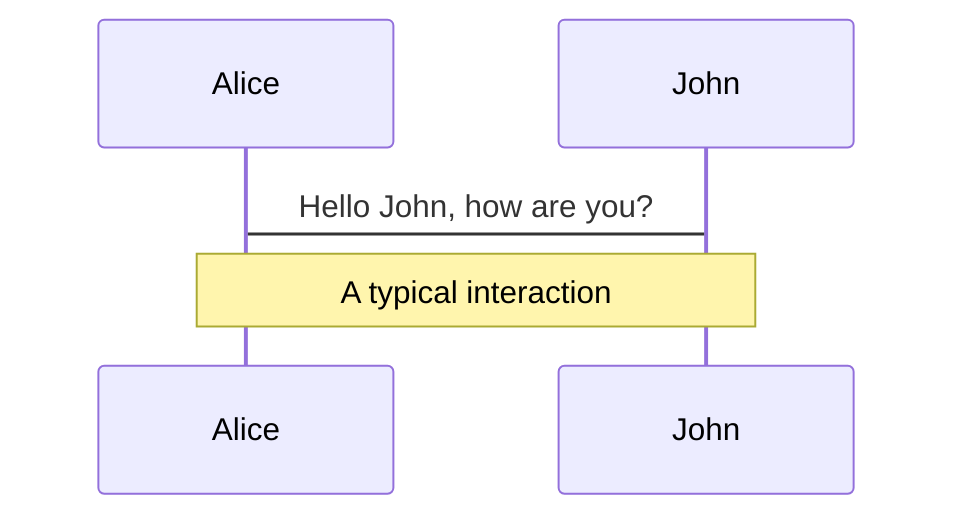
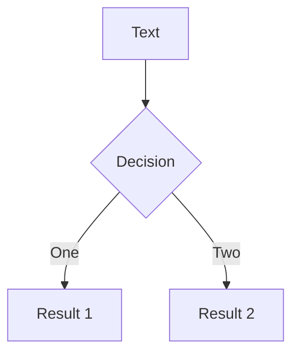
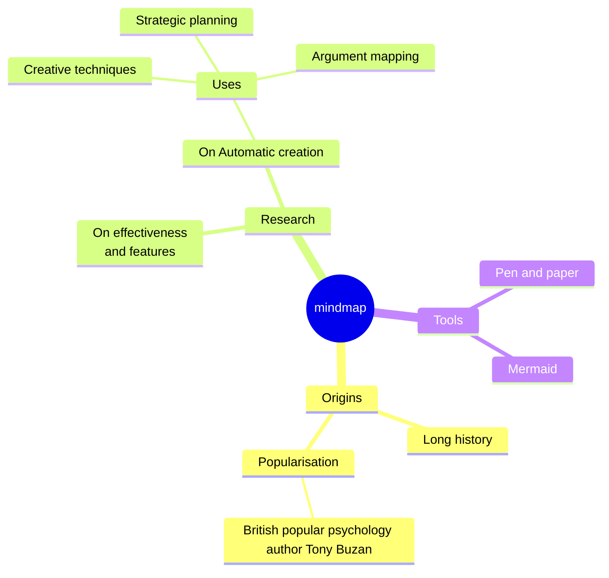
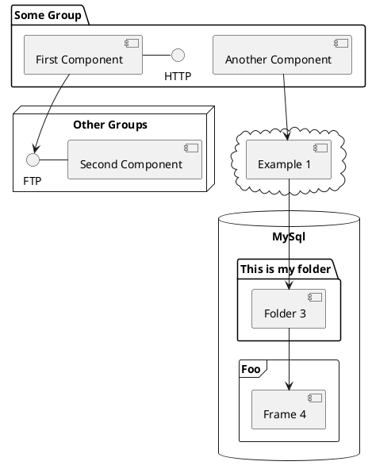

# SoEasy Network
Empowering the world's resource recycling and carbon neutral businesses with verifiable assets ownership
## 易收国际商业计划
**用数字确权推动地球资源再生和低碳产业发展**


SoEasy HK | 易收国际, 08/23/2025

---
layout: image-right
image: https://images.unsplash.com/photo-1534040385115-33dcb3acba5b?q=80&w=774&auto=format&fit=crop&ixlib=rb-4.1.0&ixid=M3wxMjA3fDB8MHxwaG90by1wYWdlfHx8fGVufDB8fHx8fA%3D%3D
---

## 「易收国际」愿景
成为全球再生资源产业数字化、价值化和国际化的引领者，通过技术赋能推动构建节约型社会，实现人类共同的环保目标。

## 「易收国际」使命
用数字确权推动全球再生资源共识和产业发展

## 「易收国际」
易收国际（SoEasy HK）将作为全球总部，统筹全球战略与技术研发；
易收中国（SoEasy China）作为首个子公司，将基于中国市场积累的经验和模式，向全球复制推广。

---
layout: dynamic-image
image: 'https://assets.breakpoints.live/shubham-dhage-_rZnChsIFuQ-unsplash.jpg'
equal: false
left: false
---

# **易收中国的成功实践**

2009 年开始，易收中国（SoEasy China）参与创立了中国电池回收行业标准、积极推动行业合规与审计，建设和验证了有效的资源回收数字化金融服务平台。

- **实现模式与技术突破：**
  - 「易收网 app」数字化运营平台服务行业数字化转型
  - 数据标准化：建立了中国电池回收数据标准，促进行业数据共享、降低合规成本
- **取得标杆成果：**
  - 建立了数字化服务平台
  - 提出了电池全生命周期碳足迹分析方法和算法
  - 推动了资源回收行业标准化
- **已验证盈利模式：**
  - [**助贷业务**](/6) - 通过佐证产业小微企业交易数据和商业信用，帮助银行落实普惠金融，为企业提供助贷服务
  - [**保险业务**](/7) - 联合保险公司推出产业专属普惠保险
  - [**税收服务**](/8) - 联合数据交易所共建可信化数字平台，为产业源头第一张发票提供数据佐证
  - [**数字化工具**](/9) - 利用「互联网+回收」系统数字化赋能资源回收行业，实现全行业降本提效

<!--
讲解要点
-->

---
layout: default
class: px-20
hide: true
---

# **资源再生未被看见的挑战** (1/2)

<div grid="~ cols-2 gap-2" m="t-2">

**问题所在：** 全球再生资源行业，包括**电池和铅回收**等关键领域，长期受困于**运营不透明、数据碎片化和信任缺失**。

**发展障碍：** 这为运营商，特别是中小企业 (SME)，带来了巨大的**合规障碍**。由于缺乏可验证的运营数据，他们也**难以获得传统金融机构的融资支持**。


</div>

<!--
 在现代经济中，数据是我们身份和工作的核心部分。然而，在传统的回收行业，运营商对自己产生的宝贵数据没有真正的所有权。他们的数字记录和交易历史可以随时被中心化平台修改或删除，使他们无法掌控自己的数字足迹。

 （铺垫范式转移的机会）
 加入例子：传统行业缺乏数字化运营能力，传统靠人的判断，是买方市场，但数据的缺失导致了信息不对称和不公平竞争。这部分有巨大的提效增值空间。为解决这个行业问题，构建数据平台服务市场参与者并给予他们经济回报。例如，一家小型电池回收商可能无法准确评估其库存价值，因为缺乏标准化的数据格式和共享机制。
 (铺垫联网数据的价值，联网数据的价值在于它能够提供透明度和可追溯性，帮助运营商更好地管理其业务，提高效率和盈利能力。)
 -->

---
layout: image-right
image: https://plus.unsplash.com/premium_photo-1682126334986-d3e22f992df2?q=80&w=1400&auto=format&fit=crop&ixlib=rb-4.1.0&ixid=M3wxMjA3fDB8MHxwaG90by1wYWdlfHx8fGVufDB8fHx8fA%3D%3D
hide: true
---

# **数据：尚未开发的资产**

- **产业观察：** 传统回收行业经历了三个阶段：
  - v1.0 - 单打独斗
  - v2.0 - 联盟合作（集采模式）
  - v3.0 - 开放共享（数证化转型）。

- **不公之处：** v2.0 阶段从业者和运营商持续不断地创造着宝贵的数据流，但其所有权和经济利益没有形成有效市场和价格体系，创造者并未从可估值到数据中获得应有的回报。

「我们有机会驱动产业数据从孤立到聚合、从聚合到数证化共享。」

<!--
每一笔回收交易、每一次物流运输和每一个处理环节都产生了海量的运营和财务数据。这些信息是优化供应链、创建实体资产通证化 (RWA) 项目、确保税务合规以及构建新型金融服务的金矿。然而，创造这些数据的企业却被隔绝在其巨大的价值之外。
-->

---
layout: default
class: px-20
hide: true
---

# 易收中国 v2.0 已验证模式

<div grid="~ cols-2 gap-2" m="t-2">

**四流合一：** 数据流、税票流、物资流、资金流

**丰富的衍生金融服务：** 金融助贷、产业保险、数字化工具、稅证业务等


</div>

---
layout: dynamic-image
image: 'https://assets.breakpoints.live/slidebean-J3AV8F-B42M-unsplash.jpg'
equal: false
left: true
---

# 中国和欧盟碳汇价格近年走势
中国的碳汇市场自2021年启动，碳汇价格（通常指碳交易市场中的碳排放权价格）呈现稳中有升的总体趋势。欧盟碳市场（EU ETS）是全球最大、最成熟的碳排放交易体系，其碳价受政策、能源结构和市场供需影响显著，极具参考性。

| |  |  | |  |
|---|---|---|---|---|
| 中国（元） | 40-50 | 55-60 | 60-80| 70-90 |
| 欧盟（欧元） | 50-60 | 80-100 | 80-90 | 60-80 |
|  | 2021 年 | 2022 年 | 2023 年 | 2024 年 |

```markdown
说明：
1. 1 欧元≈7.8人民币（综合2024全年汇率均值），欧盟碳价约为中国的 6-8倍
2. 全球碳减排量分析：2020-2023约2-3GtCO2，2024年约2.5-3.2GtCO2
3. 《巴黎协定》2030年全球碳减排目标为 20-30 GtCO₂（相比BAU情景），价值巨大
数据来源：IEA、UNEP、GCP、SEEE、ICAP、EEX
```

---
layout: dynamic-image
image: 'https://assets.breakpoints.live/john-cameron-F_EooJ3-uTs-unsplash.jpg'
equal: false
left: true
---

# 易收中国碳减排的探索与实践

 易收网和深圳技术大学商学院合作，依托易收网2016-2023年96917条交易数据以及运输行为、地理位置等数据，采用国际领先的全生命周期法进行大数据建模，对铅蓄电池全生命周期碳足迹分析计算：

 | |  |  | |  |
|---|---|---|---|---|
| 743.02 <br/> kgCO2/t | 1598.88 <br/> kgCO2/t | 845.86 <br/> kg | 158.2 <br/>t | 73.63 <br/>元 |
| 再生铅<br/>平均碳排放 | 原生铅<br/>平均碳排放 | 每吨再生铅 <br/>（同比原生铅节碳）| 每吨铅蓄电池全<br/>生命周期节碳 | 每吨再生铅<br/>节碳价值 |

> 说明：碳价指数参考复旦大学可持续发展研究中心发布2025年4月全国碳平均交易价格（87.05元/吨）

---
layout: dynamic-image
image: https://assets.breakpoints.live/jakub-zerdzicki-4rTXOMv28VA-unsplash.jpg
equal: false
left: false
---

# 易收中国业务实践：助贷业务

通过佐证产业小微企业交易数据和商业信用，帮助银行落实普惠金融，为企业提供助贷服务：

 | |  |  | |  | |
|---|---|---|---|---|---|
| **5** <br/> 亿元 | **11500.2** <br/> 万元 | **8429.75** <br/> 万元 | **10** <br/> 万元 | **7%** <br/>年化 | **50%** |
| 2024.3<br/>**银行授信 | 2024.5-10<br/>累计授信 | 2024.5-10 <br/>累计用款 | 单店<br/>用款需求| 客户<br/>用款利率 | 客户<br/>业务接受度 |

```markdown
全球业务预测：
1. 该业务能够获得的银行资金成本年化3%，易收网的利润2%
2. 全中国铅蓄电池相关产废门店约100万家，测算利润年10亿元
3. 全球铅蓄电池相关产废门店约300万家
```

---
layout: dynamic-image
image: https://assets.breakpoints.live/krakenimages-Y5bvRlcCx8k-unsplash.jpg
equal: false
left: true
---

# 易收中国业务实践：保险业务

 利用产业数据，联合保险公司推出产业专属普惠保险：

 | |  |  | |  |
|---|---|---|---|---|
| 50<br/>元/份 | 200<br/>元/份 | 200<br/>元/份 | 5.5 <br/>亿 | 1000 <br/>元 |
| 2024.12<br/>推出“车主险” | 2024.12<br/>推出“意外险” | 2024.12<br/>推出“健康险”| “车主险”<br/>覆盖人群 | “健康险”“意外险”<br/>覆盖人群 |

```markdown
全球业务预测：
1. 该业务全中国整体产业规模超过300亿元4
2. 预计3年覆盖国内10%市场份额，实现保费30亿元，分润比例达25%，利润7.5亿元
3. 三款保险覆盖全球超过10亿车主及产业从业者

数据来源：OICA、CONEBI、CBA
```

---
layout: dynamic-image
image: https://assets.breakpoints.live/markus-winkler-Ber3q-zEhd4-unsplash.jpg
equal: false
left: false
---

# 易收中国业务实践：税收服务

> 联合数据交易所共建可信化数字平台，为产业源头第一张发票提供数据佐证：

**产业现状与解决方案**

产业「源头发票」现行的方式自制凭证/反向开票都没有达到预期，导致虚开发票的现象大量存在
易收网的可信数字化平台认证企业数据形成可信数据包，进而为反向开票业务进行佐证
该业务按照 2‰ 收取数据佐证服务费。

```markdown
全球业务预测
1. 据相关专家估算中国再生资源产业的规模超过15万亿元
2. 中国再生资源产业的规模应该占全球总规模的40%左右，以此推算，全球总规模约37.5万亿
```

> **数字服务业务后续可以推广至公安局、社保局、大数据局、亿元等进行广泛应用。**

---
layout: dynamic-image
image: https://assets.breakpoints.live/teb-network-landing.png
equal: false
left: true
---

# 易收中国业务实践：数字化工具

利用“互联网+回收“系统，通过数字化赋能，为行业降本提效：

 | |  |  | |  |
|---|---|---|---|---|
| 陕西xx集团<br/>深圳xx公司 | 53 <br/> 家 | 109657 <br/> 单 | 144861<br/>吨 | 61846<br/>家 |
| 2018-2020<br/>典型案例 | 2021-2024<br/>服务回收企业 | 累计<br/>回收订单 | 累计<br/>回收吨位 | 服务<br/>门店数 |

```markdown
全球业务预测
1. 废铅蓄电池全中国整体回收规模超过1500万吨，产业规模超过 1500 亿元
（按照 2024 年全年平均价格 10030 元/吨计算）。
2. 预计 3 年内实现年赋能行业 20% 以上市场份额，年规模超过 300 亿元，
收取 2‰ 服务费，利润 6000 万元。

数据来源：SMM、《中国环境统计年报》、中国有色金属网等资料数据推算
```

---
layout: dynamic-image
image: https://assets.breakpoints.live/photo-network.png
equal: false
left: false
---

# 从易收中国到易收国际（1/2）
## 1. 用 Web3 确权科技全球复制运营智能

**解决方案：** SoEasy Network 通过构建一个**去中心化的数据预言机（Data Oracle）和市场网络（Market Network）**，来解决这些行业挑战。

**行业变革：** 我们将原始、碎片化的运营数据转化为**可验证、可审计且不可篡改的数字资产**，为整个行业打造一个单一事实来源 (Single Source of Truth)。

## 2. 通证经济 + 零工经济：全球规模赋能

**解决方案：** 易收国际帮助全球成员机构实现本国资源回收行业的「出租车司机 vs. Uber」模式。

**行业变革：** 易收中国作为网络创世节点，通过 SoEasy Network 赋能全球资源回收行业数证化升级。

<!--
SoEasy Network 旨在将数字所有权革命带入再生资源行业。我们正在构建一个能够服务全球回收企业的去中心化数据市场。通过将实体运营与去中心化金融 (DeFi) 相连接，我们实现了透明且可验证的实体资产 (RWA) 管理，确保每一个真实的业务行为都能在区块链上拥有一个可信的数字记录。

SoEasy Network 旨在将数字所有权革命带入再生资源行业。我们正在构建一个能够服务全球回收企业的去中心化数据市场。通过将实体运营与去中心化金融 (DeFi) 相连接，我们实现了透明且可验证的实体资产 (RWA) 管理，确保每一个真实的业务行为都能在区块链上拥有一个可信的数字记录。
-->

---
layout: dynamic-image
image: https://assets.breakpoints.live/traxer-VkFLGd6JxOQ-unsplash.jpg
equal: false
left: true
---

# 从易收中国到易收国际（2/2）
## 3. 溯源与信任：确权与资产数证化

- **RWA融合：** 将回收数据（如回收量、种类、环保贡献等）转化为可量化的真实世界资产（RWA），并通过区块链技术发行相应的数字通证。这些通证代表了回收行为产生的环保价值和未来收益权。
- **数字通证激励：** 通过数字通证（积分）奖励数据提供者和回收参与者，实现「数据即财富」。数字通证的可持续发行机制，将解决传统资金有限的问题，为生态系统提供源源不断的资金支持，并赋予参与者巨大的潜在收益空间。
- **赋能模式：** 易收不与现有回收企业竞争，而是赋能所有产业链参与者，帮助他们将其环保贡献转化为可交易的碳交易价值，实现多方共赢。
- **数据完整性：** **易收国际平台 / SoEasy Network** 确保数据完整性和可审计性。我们使用_链上证明锚定_来保障数据库状态，并要求所有事件进行加密签名。
- **可验证记录：** 数据被捕获为**不可变资源事件记录**，并在源头进行加密签名。我们将利用零知识证明（ZKP）来确保完整性和商业隐私。
- **合规就绪：** 这种高完整性数据创建了一个可信的财务账本，这对于开发**自动化税务合规解决方案**和消除不透明交易至关重要。
- **高效跨境支付：** 提供基于区块链技术的跨境支付服务（PayFi），实现 T+0 到账和更低费率，简化国际贸易流程。
- **全球统一平台：** 建立全球化的回收数据交易与管理平台，实现数据共享、价值透明化和高效流通。

<!--
数字权利之争取决于溯源。当 Getty Images 起诉一位 AI 创作者时，是因为他们能证明其图片未经许可被使用。区块链解决了数字财产的溯源问题。这对于可再生资源行业至关重要，因为可追溯性和信任是其全部。我们的系统将原始数据转化为可验证的财务记录，满足最严格的合规要求，同时利用 ZKP 保护敏感的商业数据。
-->

---
layout: dynamic-image
image: https://assets.breakpoints.live/ibrahim-rifath-OApHds2yEGQ-unsplash.jpg
equal: false
left: false
hide: false
---

# 易收国际商业模式（1/6）

## 核心理念：
构建可验证运营数据的「数据预言机 / Data Oracle」去中心化数据市场网络，并基于这些可验证数据流构建全球市场服务，实现「环保价值数证化」，特别是全球碳权资产的确认、计量、交易。

资源回收数据提供者，例如新能源装备企业、回收企业、从业者个人，透过开源的运营「数据工具」完成数据同步和脱敏，从平台获得数字通证（积分）。平台利用这些积分帮助市场参与者在本国复制「易收中国已验证的四大衍生金融服务」。

---
layout: dynamic-image
image: https://assets.breakpoints.live/david-hofmann-GFt6VfdVdbk-unsplash.jpg
equal: false
left: true
hide: false
---

# 易收国际商业模式（2/6）
## 目标市场：
- **初期阶段：** 重点聚焦电池回收市场，特别是来自电动车和各类储能电池等；
- **区域拓展：** 首先规模化已验证的中国市场运营模式，同时构建开源的运营数据和应用平台，随后逐步推广至东南亚、南亚、中东、非洲、南美等新兴市场，最后进入欧美等发达市场，实现全球化覆盖。
- **目标客户：** 全球资源回收和再生企业、个体回收商、环保机构、碳资产投资者、关注 SDG/ESG 的影响力投资者。

---
layout: dynamic-image
image: https://assets.breakpoints.live/photo-network.png
equal: false
left: false
hide: false
---

# 易收国际商业模式（3/6）
## 全球推广策略：

- **开发者与数据工具产品社群：** 建立活跃的线上线下开发者与加盟机构社群，吸引和教育潜在用户和投资者。
- **数据节点加盟：** 全球各地运营商通过开源可信的数据工具，自主构建本国的衍生金融服务。
- **算力节点质押加盟：** SoEasy Network 自建区块链网络的基础算力质押加盟。
- **跨境行业合作：** 与各地的回收协会、环保组织、政府机构建立战略合作关系。
- **树立示范项目：** 推出成功案例，展示易收国际平台在构建本国资源回收衍生业务的效率、效果和新价值捕获方面的能力。

---
layout: dynamic-image
image: https://assets.breakpoints.live/photo-network.png
equal: false
left: true
---

# 易收国际商业模式（4/6）
## 营收规划（1/2）
易收国际营收将分为两个发展阶段，形成多层次可持续的盈利模式：

## 阶段一：数据订阅市场交易费
- **来源：** 平台成员机构的数据交易量和订阅服务交易费佣金 %。
- **模式：** 用户（企业或机构）根据其对回收数据的访问、分析和交易需求支付订阅费或交易佣金。高质量、实时更新的回收数据将成为平台的核心资产。
- **发展：** 随着用户数量和数据规模的增长，此项收入将成为易收的基础和稳定现金流。

---
layout: dynamic-image
image: https://assets.breakpoints.live/photo-network.png
equal: false
left: false
---

# 易收国际商业模式（5/6）
## 营收规划（2/2）
易收国际营收将分为三个发展阶段，形成多层次可持续的盈利模式：

## 阶段二：跨境支付（PayFi）服务费

- **来源：** 基于区块链技术的跨境支付服务所收取的交易服务费。
- **模式：** 易收提供比传统银行更快速（T+0到账）、费率更低（预计 5% - 6%）的国际结算服务，尤其针对回收物资的国际贸易。
- **发展：** 随着易收全球化布局的深入和国际贸易伙伴的增加，跨境支付将带来可观的服务收入。

---
layout: dynamic-image
image: https://assets.breakpoints.live/photo-network.png
equal: false
left: true
---

# 易收国际商业模式（6/6）
## 营收规划（3/3）
易收国际营收将分为三个发展阶段，形成多层次可持续的盈利模式：

## 阶段三：衍生金融业务跨境合作

- **来源：** 利用易收国际发布的数证化开源工具和平台服务，帮助全球资源回收企业结合本国情况实现助贷业务、保险业务、税收服务等资源再生行业的衍生金融业务。
- **模式：** 易收国际透过免费+开源的数证化工具，帮助加盟机构轻松构建支撑结合本国营商环境的衍生金融业务。
- **发展：** 这是易收国际数证化工具平台和市场网络平台发布后，可支撑全球「入网成员机构」的高级收入来源，代表全球领先的资源回收产业金融化和资产证券化方面的综合能力。

---
layout: dynamic-image
image: https://assets.breakpoints.live/photo-network.png
equal: false
left: true
hide: true
---

# 易收国际商业模式（6/6）
## 营收规划（3/3）
易收国际营收将分为三个发展阶段，形成多层次可持续的盈利模式：

## 阶段三：再生资源资产交易服务

- **来源：** 帮助全球资源回收企业发行其专属的数字通知和资产，以及促成这些数字资产的买卖所收取的手续费。
- **模式：** 易收将搭建一个类似「俱乐部」的平台，吸引符合易收价值观和投资回报预期的机构和个人投资者，参与回收产业数字资产的发行与交易。
- **发展：** 这是易收最高层级的收入来源，代表了其在回收产业金融化和资产证券化方面的综合能力和实力。通过赋能实体企业发行数字资产，易收将成为连接真实世界环保贡献与数字资本市场的关键枢纽。

---
layout: dynamic-image
image: https://assets.breakpoints.live/krakenimages-Y5bvRlcCx8k-unsplash.jpg
equal: false
left: false
---

# 管理团队

- 李劲松：易收集团创始人
  - 核心战略思想提出者；负责商业模式设计、RWA 融合和全球战略决策。
- 核心成员：
  - Chance Jiang，CEO，SoEasy HK，擅长区块链技术与加密经济、市场营销与业务拓展，同时负责核心数据平台产品和工程技术研发
  - Emily Luo，COO，SoEasy HK，擅长回收产业运营与管理、国际贸易与跨境支付，法律合规与基金管理
  - Jane Zheng，CMO，SoEasy HK，擅长技术和产品社区运营，市场营销与业务拓展
- 董事会：
  - 董事长：李劲松
  - 副董事长：Chance Jiang
  - 董事：Emily Luo, 以及来自著名可持续发展和社会创新机构的代表等。

---
layout: dynamic-image
image: https://assets.breakpoints.live/krakenimages-Y5bvRlcCx8k-unsplash.jpg
equal: false
left: true
---

# DAO 组织治理

- SoEasy Network 的区块链和数据科技平台的顶级决策交给 SoEasy DAO，一个由国际知名 SDG/ESG 和可持续发展组织代表参与治理的去中心化组织。
- **SoEasy DAO 组织原则**：
  * **纯粹的民主制 (Pure Democracy):** SoEasy 治理系统是一个纯粹的民主制，每个会员银行都拥有一票投票权，并可以在任何时候发起投票。
  * **高门槛的行动 (High-Threshold Actions):** 为了防止浪费时间进行不必要的投票，任何行动都需要 80% 的超级多数才能通过。
  * **首席执行官的权力 (CEO's Power):** 在这种制度下，由于会员需要相互协调，首席执行官（如 Chance Jiang）具有很大的影响力，所有人都愿意听取他的意见。
  * **禁止参与竞争网络 (Prohibition on Competing Networks):** 这种治理系统隐含地禁止会员银行同时参与或组建竞争性的行业平台网络。
  * **统一的规则和程序 (Uniform Rules and Procedures):** 所有会员都必须遵守一套单一、通用的操作和治理程序，这套规则类似于一部宪法，同样需要 80% 的投票才能修改。

---
layout: dynamic-image
image: https://assets.breakpoints.live/giorgio-trovato-WyxqQpyFNk8-unsplash.jpg
equal: false
left: false
---

# 股权融资需求

- **种子轮融资额：**
  - 融资 1 亿 RMB，出让 20% 股权，估值 5 亿 RMB
- **资金用途：**
  - **技术研发与运营：** 持续投入区块链技术、数据分析、AI等核心技术的研发，确保平台领先性。
  - **团队与人才：** 吸引全球顶尖的技术、运营、市场和管理人才。
  - **市场与全球拓展：** 覆盖不同区域的市场营销、渠道建设、本地化运营和合作伙伴拓展。
  - **合规与法务：** 确保全球范围内的运营符合当地法律法规。
  - **运营资本：** 维持日常运营所需资金。

> 说明：参考「易收国际营收规划」了解我们的营收发展阶段模型和关键指标。
> 投资沟通中，我们将提供更详细的信息，包括收入、成本、利润和现金流等关键指标。

---
layout: dynamic-image
image: https://assets.breakpoints.live/giorgio-trovato-WyxqQpyFNk8-unsplash.jpg
equal: false
left: true
hide: true
---

# 投资亮点

- **市场潜力巨大：** 全球资源回收业规模大增长快，数证化金融服务是必然趋势。
- **颠覆性创新：** RWA与区块链融合，开创回收产业新格局，解决行业痛点。
- **独特赋能模式：** 与行业共赢，构建可持续发展的生态系统。
- **社会与环境价值：** 积极响应全球环保号召，具有强大的社会影响力。
- **全球化战略：** 基于中国成功经验，惠及全球加盟机构和市场。
- **多元化收入：** 多层次盈利模式，确保长期稳定增长。

---
layout: dynamic-image
image: https://assets.breakpoints.live/michael-shannon-mE6zS5LwScM-unsplash.jpg
equal: false
left: false
hide: false
---

# 风险提示

- **技术风险：** 技术发展迅速，需持续投入研发以保持领先。
- **市场风险：** 新模式的市场教育和用户习惯培养需要时间。
- **监管风险：** 全球各地对数字资产和区块链的监管政策尚不明朗，需密切关注并保持合规。
- **竞争风险：** 可能出现新的竞争对手或现有巨头进入。
- **执行风险：** 全球化拓展涉及文化差异、本地化运营等挑战。

---
layout: dynamic-image
image: https://assets.breakpoints.live/milad-fakurian-wNsHBf_bTBo-unsplash.jpg
left: true
hide: false
---

# SoEasy Network
## 用数证化基建推动全球低碳发展

- **宏大愿景：** **SoEasy Network** 旨在为全球再生资源行业提供**核心技术基础设施**，带来透明度、效率和信任，赋能全球市场。

- **成长路径：**
  - 我们已启动面向试点国家和地区的「科技向善」SDG 项目，例如新能源智能厨具套件捐助项目等。
  - 我们正沿着 **IP/品牌资产 > RWA/数字资产 > IPO/金融资产** 的路径，招募全球节点运营商。

- **核心原则：**
  - 我们将**清晰产权与产业繁荣**的引入资源再生世界市场，「以恒产促恒心」赋能本地运营商。
  - **ESG 价值**：促进就业与收入，提升职业发展，用数证化工具推动全球资源回收业的可持续发展。

易收国际致力于通过将回收数据转化为可交易的数字资产，彻底改变传统回收行业，为所有参与者创造新价值，并为构建更绿色、高效的全球经济做出贡献。

<!--
乔治·华盛顿曾写道：‘自由与财产权密不可分。’ 这句话同样适用于虚拟世界。为了确保我们的数字自由——使我们不成为平台或未来人工智能的奴隶——我们必须拥有真正的数字产权。通过为再生资源建立这些权利，SoEasy Network 正在为所有人构建一个更公平、更透明、更繁荣的全球经济，与全球关键市场的强大本地合作和所有权开始。
-->

---
layout: dynamic-image
image: https://assets.breakpoints.live/toa-heftiba-QnUywvDdI1o-unsplash.jpg
---

# 投资咨询联系人

<br/><br/><br/>
## _**Chance Jiang**_
CEO, SoEasy HK<br/>
#### chance@teb.network <br/>


---
transition: fade-out
hide: true
---

# What is Slidev?

Slidev is a slides maker and presenter designed for developers, consist of the following features

- 📝 **Text-based** - focus on the content with Markdown, and then style them later
- 🎨 **Themable** - themes can be shared and re-used as npm packages
- 🧑‍💻 **Developer Friendly** - code highlighting, live coding with autocompletion
- 🤹 **Interactive** - embed Vue components to enhance your expressions
- 🎥 **Recording** - built-in recording and camera view
- 📤 **Portable** - export to PDF, PPTX, PNGs, or even a hostable SPA
- 🛠 **Hackable** - virtually anything that's possible on a webpage is possible in Slidev
<br>
<br>

Read more about [Why Slidev?](https://sli.dev/guide/why)

<!--
You can have `style` tag in markdown to override the style for the current page.
Learn more: https://sli.dev/features/slide-scope-style
-->

<style>
h1 {
  background-color: #2B90B6;
  background-image: linear-gradient(45deg, #4EC5D4 10%, #146b8c 20%);
  background-size: 100%;
  -webkit-background-clip: text;
  -moz-background-clip: text;
  -webkit-text-fill-color: transparent;
  -moz-text-fill-color: transparent;
}
</style>

<!--
Here is another comment.
-->

---
transition: slide-up
level: 2
hide: true
---

# Navigation

Hover on the bottom-left corner to see the navigation's controls panel, [learn more](https://sli.dev/guide/ui#navigation-bar)

## Keyboard Shortcuts

|                                                     |                             |
| --------------------------------------------------- | --------------------------- |
| <kbd>right</kbd> / <kbd>space</kbd>                 | next animation or slide     |
| <kbd>left</kbd>  / <kbd>shift</kbd><kbd>space</kbd> | previous animation or slide |
| <kbd>up</kbd>                                       | previous slide              |
| <kbd>down</kbd>                                     | next slide                  |

<!-- https://sli.dev/guide/animations.html#click-animation -->

<p v-after class="absolute bottom-23 left-45 opacity-30 transform -rotate-10">Here!</p>

---
layout: two-cols
layoutClass: gap-16
hide: true
---

# Table of contents

You can use the `Toc` component to generate a table of contents for your slides:

```html
<Toc minDepth="1" maxDepth="1" />
```

The title will be inferred from your slide content, or you can override it with `title` and `level` in your frontmatter.

::right::

<Toc text-sm minDepth="1" maxDepth="2" />

---
layout: image-right
image: https://cover.sli.dev
hide: true
---

# Code

Use code snippets and get the highlighting directly, and even types hover!

```ts [filename-example.ts] {all|4|6|6-7|9|all} twoslash
// TwoSlash enables TypeScript hover information
// and errors in markdown code blocks
// More at https://shiki.style/packages/twoslash
import { computed, ref } from 'vue'

const count = ref(0)
const doubled = computed(() => count.value * 2)

doubled.value = 2
```

<arrow v-click="[4, 5]" x1="350" y1="310" x2="195" y2="342" color="#953" width="2" arrowSize="1" />

<!-- This allow you to embed external code blocks -->

<!-- Footer -->

[Learn more](https://sli.dev/features/line-highlighting)

<!-- Inline style -->
<style>
.footnotes-sep {
  @apply mt-5 opacity-10;
}
.footnotes {
  @apply text-sm opacity-75;
}
.footnote-backref {
  display: none;
}
</style>

<!--
Notes can also sync with clicks

[click] This will be highlighted after the first click

[click] Highlighted with `count = ref(0)`

[click:3] Last click (skip two clicks)
-->

---
level: 2
hide: true
---

# Shiki Magic Move

Powered by [shiki-magic-move](https://shiki-magic-move.netlify.app/), Slidev supports animations across multiple code snippets.

Add multiple code blocks and wrap them with <code>````md magic-move</code> (four backticks) to enable the magic move. For example:

````md magic-move {lines: true}
```ts {*|2|*}
// step 1
const author = reactive({
  name: 'John Doe',
  books: [
    'Vue 2 - Advanced Guide',
    'Vue 3 - Basic Guide',
    'Vue 4 - The Mystery'
  ]
})
```

```ts {*|1-2|3-4|3-4,8}
// step 2
export default {
  data() {
    return {
      author: {
        name: 'John Doe',
        books: [
          'Vue 2 - Advanced Guide',
          'Vue 3 - Basic Guide',
          'Vue 4 - The Mystery'
        ]
      }
    }
  }
}
```

```ts
// step 3
export default {
  data: () => ({
    author: {
      name: 'John Doe',
      books: [
        'Vue 2 - Advanced Guide',
        'Vue 3 - Basic Guide',
        'Vue 4 - The Mystery'
      ]
    }
  })
}
```

Non-code blocks are ignored.

```vue
<!-- step 4 -->
<script setup>
const author = {
  name: 'John Doe',
  books: [
    'Vue 2 - Advanced Guide',
    'Vue 3 - Basic Guide',
    'Vue 4 - The Mystery'
  ]
}
</script>
```
````

---
hide: true
---

# Components

<div grid="~ cols-2 gap-4">
<div>

You can use Vue components directly inside your slides.

We have provided a few built-in components like `<Tweet/>` and `<Youtube/>` that you can use directly. And adding your custom components is also super easy.

```html
<Counter :count="10" />
```

<!-- ./components/Counter.vue -->
<Counter :count="10" m="t-4" />

Check out [the guides](https://sli.dev/builtin/components.html) for more.

</div>
<div>

```html
<Tweet id="1390115482657726468" />
```

<Tweet id="1390115482657726468" scale="0.65" />

</div>
</div>

<!--
Presenter note with **bold**, *italic*, and ~~striked~~ text.

Also, HTML elements are valid:
<div class="flex w-full">
  <span style="flex-grow: 1;">Left content</span>
  <span>Right content</span>
</div>
-->

---
class: px-20
hide: true
---

# Themes

Slidev comes with powerful theming support. Themes can provide styles, layouts, components, or even configurations for tools. Switching between themes by just **one edit** in your frontmatter:

<div grid="~ cols-2 gap-2" m="t-2">

```yaml
---
theme: default
---
```

```yaml
---
theme: seriph
---
```


</div>

Read more about [How to use a theme](https://sli.dev/guide/theme-addon#use-theme) and
check out the [Awesome Themes Gallery](https://sli.dev/resources/theme-gallery).

---
hide: true
---

# Clicks Animations

You can add `v-click` to elements to add a click animation.

<div v-click>

This shows up when you click the slide:

```html
<div v-click>This shows up when you click the slide.</div>
```

</div>

<br>

<v-click>

The <span v-mark.red="3"><code>v-mark</code> directive</span>
also allows you to add
<span v-mark.circle.orange="4">inline marks</span>
, powered by [Rough Notation](https://roughnotation.com/):

```html
<span v-mark.underline.orange>inline markers</span>
```

</v-click>

<div mt-20 v-click>

[Learn more](https://sli.dev/guide/animations#click-animation)

</div>

---
hide: true
---

# Motions

Motion animations are powered by [@vueuse/motion](https://motion.vueuse.org/), triggered by `v-motion` directive.

```html
<div
  v-motion
  :initial="{ x: -80 }"
  :enter="{ x: 0 }"
  :click-3="{ x: 80 }"
  :leave="{ x: 1000 }"
>
  Slidev
</div>
```

<div class="w-60 relative">
  <div class="relative w-40 h-40">
    
    
    
  </div>

  <div
    class="text-5xl absolute top-14 left-40 text-[#2B90B6] -z-1"
    v-motion
    :initial="{ x: -80, opacity: 0}"
    :enter="{ x: 0, opacity: 1, transition: { delay: 2000, duration: 1000 } }">
    Slidev
  </div>
</div>

<!-- vue script setup scripts can be directly used in markdown, and will only affects current page -->
<script setup lang="ts">
const final = {
  x: 0,
  y: 0,
  rotate: 0,
  scale: 1,
  transition: {
    type: 'spring',
    damping: 10,
    stiffness: 20,
    mass: 2
  }
}
</script>

<div
  v-motion
  :initial="{ x:35, y: 30, opacity: 0}"
  :enter="{ y: 0, opacity: 1, transition: { delay: 3500 } }">

[Learn more](https://sli.dev/guide/animations.html#motion)

</div>

---
hide: true
---

# LaTeX

LaTeX is supported out-of-box. Powered by [KaTeX](https://katex.org/).

<div h-3 />

Inline $\sqrt{3x-1}+(1+x)^2$

Block
$$ {1|3|all}
\begin{aligned}
\nabla \cdot \vec{E} &= \frac{\rho}{\varepsilon_0} \\
\nabla \cdot \vec{B} &= 0 \\
\nabla \times \vec{E} &= -\frac{\partial\vec{B}}{\partial t} \\
\nabla \times \vec{B} &= \mu_0\vec{J} + \mu_0\varepsilon_0\frac{\partial\vec{E}}{\partial t}
\end{aligned}
$$

[Learn more](https://sli.dev/features/latex)

---
hide: true
---

# Diagrams

You can create diagrams / graphs from textual descriptions, directly in your Markdown.

<div class="grid grid-cols-4 gap-5 pt-4 -mb-6">









</div>

Learn more: [Mermaid Diagrams](https://sli.dev/features/mermaid) and [PlantUML Diagrams](https://sli.dev/features/plantuml)

---
foo: bar
dragPos:
  square: 691,32,167,_,-16
hide: true
---

# Draggable Elements

Double-click on the draggable elements to edit their positions.

<br>

###### Directive Usage

```md

```

<br>

###### Component Usage

```md
<v-drag text-3xl>
  <div class="i-carbon:arrow-up" />
  Use the `v-drag` component to have a draggable container!
</v-drag>
```

<v-drag pos="626,215,261,_,-15"undefinedundefinedundefinedundefinedundefinedundefinedundefinedundefinedundefinedundefinedundefinedundefinedundefinedundefinedundefinedundefinedundefinedundefinedundefinedundefined>
  <div text-center text-3xl border border-main rounded>
    Double-click me!
  </div>
</v-drag>


###### Draggable Arrow

```md
<v-drag-arrow two-way />
```
<v-drag-arrow pos="67,452,253,46" two-way op70 />
