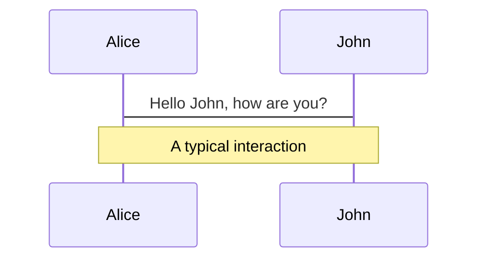
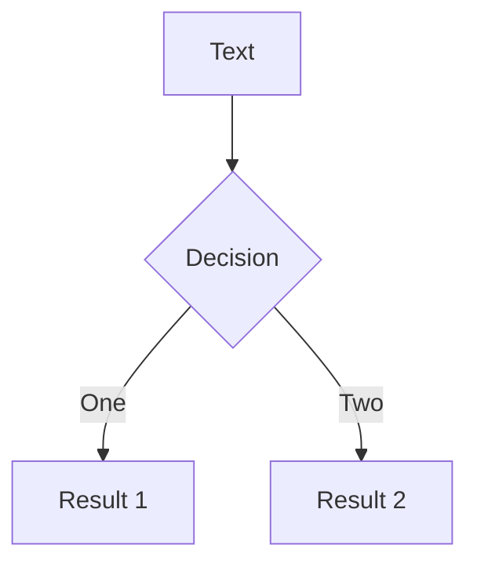
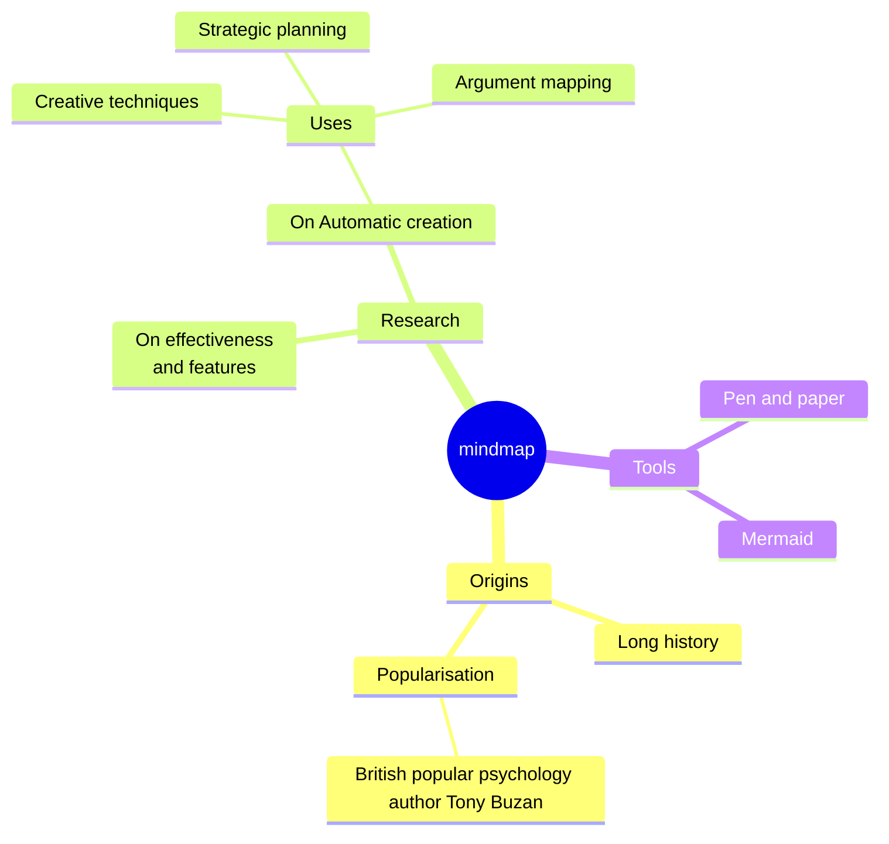
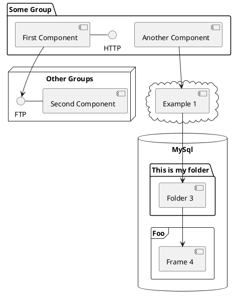

<br/>

# **SoEasy Network**

## Empowering Global Resource Recycling Businesses <br/> with Verifiable Digital Ownership

SoEasy HK | 易收国际, 07/19/2025

---
layout: default
---

# **The Unseen Challenge in Renewable Resources**

- **The Problem:** The global renewable resources industry, including critical sectors like **battery and lead recycling**, is hampered by **operational opacity, fragmented data, and a fundamental lack of trust.**

- **The Barriers:** This creates significant **compliance hurdles** for operators, especially small and medium-sized enterprises (SMEs). It also **blocks their access to traditional financing** because they lack the verifiable operational data required by lenders.

<!--
> "In the modern economy, our data is a core part of our identity and work. Yet, in the traditional recycling industry, operators have no true ownership over the valuable data they generate. Their digital records and transaction histories can be altered or erased by centralized platforms at any time, leaving them without control over their own digital footprint.
-->

---
layout: default
---

# Data: The Untapped Asset
## of the Recycling Industry

- **The Observation:** Data is the fuel for every major innovation today, from artificial intelligence to supply chain optimization.

- **The Injustice:** While recycling operators generate a constant stream of valuable data, its ownership and financial benefits are captured almost exclusively by siloed, centralized platforms. The creators of the value are not compensated for it.

<!--
Every recycling transaction, logistical movement, and processing event generates a wealth of operational and financial data. This information is a goldmine for optimizing supply chains, creating Real-World Asset (RWA) projects, ensuring tax compliance, and building new financial services. Yet, the very businesses generating this data are cut off from its immense value.
-->

---
layout: default
---
# Web3 & Blockchain:
## The Foundation for True Digital Ownership

- **The Solution:** **SoEasy Network** tackles these industry challenges by building a **decentralized data oracle and marketplace infrastructure.**

- **The Transformation:** Our platform transforms raw, fragmented operational data into **verifiable, auditable, and immutable digital assets**, creating a single source of truth for the entire industry.

<!--
SoEasy Network is engineered to bring the digital ownership revolution to the renewable resources industry. We are building a global, decentralized data market that can serve recycling businesses worldwide. By connecting physical operations with decentralized finance (DeFi), we enable transparent and verifiable Real-World Asset (RWA) management, ensuring every real-world action is represented by a trusted digital record on the blockchain.
-->

---
layout: default
---

# How Ownership Drives
## Economic Freedom and Value

- **Empowerment:** **Ownership of verified data** grants participants true economic freedom, including the right to transact freely and benefit from powerful **network effects.**

- **New Pathways:** The tokenization of recycling data into **RWA tokens** opens unprecedented financing, trading, and investment channels for all ecosystem participants.

- **Valuation:** RWA projects provide a powerful mechanism for **market-based financing and valuation**, helping companies establish their true market value long before a traditional IPO.

<!--
This model applies directly to SoEasy Network. By tokenizing real-world recycling data, companies can issue RWA tokens that represent the value of their operations. This creates opportunities for businesses to access capital and for investors to gain exposure to the asset's performance. The platform’s ability to make operations and revenue transparent and auditable builds the trust necessary for a credible pre-IPO valuation.
-->

---
layout: default
---
# Empowering the Global Ecosystem
## of resource recycling businsses

- **Economic Engine:** The native **SEN token** is the economic engine of the _SoEasy Network_ ecosystem.

- **Utility:** It functions as the **primary _Unit of Account_ for data transactions** on our decentralized marketplace. Fees for data verification, access, and advanced services are paid in SEN.

- **Incentives:** A **Token Reward mechanism** incentivizes data providers to contribute high-quality, verifiable data completely and promptly.

- **Staking & Governance:** Participants can stake SEN to help secure the network, access premium features, and participate in **decentralized governance.**
  - SoEasy China being _the 1st genesis node_ to secure the network
  - along with other member nodes, operated by early partners of resource recycling businesses

<!--
The SEN token’s value is intrinsically linked to the platform's adoption and the utility of the data within it. This model ensures that those who contribute valuable operational data are directly rewarded, fostering a robust, self-sustaining ecosystem where all participants benefit from the collective effort.
-->

---
layout: default
---

# **Decentralized Governance & Stakeholder Tokenomics** (1/2)

- **A New Paradigm:** This represents a fundamental shift from traditional _shareholder capitalism_ to **stakeholder tokenomics**, where every participant—from the smallest recycling store to the largest investor—becomes an owner and decision-maker.

- **Community Control:** **SoEasy Network** is designed as a **decentralized autonomous organization (DAO)**, with future governance managed by SEN token holders, namely, the participating members around the global, with SoEasy China as the founding member and genesis node (of data).

- **Proven Blockchain Tech:** We leverage established blockchain tech like the SPL Governance standard to enable flexible and secue stakeholder tokenomics control.

---
layout: default
---

# **Decentralized Governance & Stakeholder Tokenomics** (2/2)

- **Incubating Your Own Recycling Business with SoEasy Network:**
  - SoEasy Network will incubate recycling businesses around the world, starting with a **< 49% initial stakes**.
  - Over time, _SoEasy Network_'s stakes can be split among new local stake-holders, ensuring a fair distribution of ownership and control by a solvereign state.

- **Genesis Node as the Initial Operation Intelligence Provider:**
  - _SoEasy China_, as the genesis node and the founding member, is empowering **new member companies** with its growing operation intelligence via AI agents to upgrade or optimize their local operations.
  - Countries with increasing adoption on renewable energy systems will benefit the most from SoEasy Network's participation to achieve their SDG goals, while boosting local economies.

<!--
Our vision for `Soeasy Network` is a global ecosystem where participants co-build, co-share, and co-win. Through token incentives and smart contracts, we quantify and reward contributions, ensuring that all stakeholders are aligned and have a vested interest in the network's success. This model enables us to foster local ownership and market validation, as exemplified by our approach to establishing operations in Thailand.
-->

---
layout: default
---

# Provenance & Trust:
## The Foundation of RWA

- **Data Integrity:** _SoEasy Network_ guarantees data integrity and auditability. We use _On-Chain Proof Anchoring_ to secure the database state and require cryptographic signing for all events.

- **Verifiable Records:** Data is captured as **Immutable Resource Event Records**, cryptographically signed at the source. We will leverage Zero-Knowledge Proofs (ZKP) to ensure both integrity and commercial privacy.

- **Compliance-Ready:** This high-integrity data creates a trusted financial ledger, which is essential for developing **automated tax compliance solutions** and eliminating opaque transactions.

<!--
The fight for digital rights hinges on provenance. When Getty Images sued an AI creator, it was because they could prove their images were used without permission. Blockchain solves the problem of provenance for digital property. This is vital for the renewable resources industry, where traceability and trust are everything. Our system transforms raw data into verifiable financial records, satisfying the most stringent compliance requirements while using ZKP to protect sensitive commercial data.
-->

---
layout: default
---

# The Future: Prosperity Through
## Property Rights and Local Empowerment

- **The Vision:** _SoEasy Network_ is the **essential technological infrastructure** designed to bring transparency, efficiency, and trust to the global renewable resources industry, with a strong focus on empowering local markets like Thailand.

- **The Pathway:**
  - We've started with _Tech for Social Good_ international SDG programs, to signup local partners and organizations.
  - SoEasy China, genesis node enable **IP (Brand Assets) -> RWA (Digital Assets) -> IPO (Financial Assets)** pathway to success, adapting this blueprint for local market nuances and fostering local ownership.

- **The Core Principle:** History has proven the unbreakable link between **strong property rights and the prosperity of nations.** We are bringing this principle to the digital world, ensuring that local stakeholders in markets like Thailand have true digital ownership and control over their valuable recycling data.

<!--
George Washington wrote, 'Freedom and property rights are inseparable.' The same is true for the virtual realm. To ensure our digital freedom—so that we are not slaves to platforms or future AIs—we must have true digital property rights. By establishing these rights for recycled resources, **SoEasy Network** is building a fairer, more transparent, and more prosperous global economy for all, beginning with strong local partnerships and ownership in key markets like Thailand.
-->

---
layout: cover
---
<br/>

# 易收国际平台
# SoEasy Network
**用数字确权引领资源再生、赋能可持续发展的未来**

---
layout: default
---

# **再生资源领域未被看见的挑战**

- **问题所在：** 全球再生资源行业，包括**电池和铅回收**等关键领域，长期受困于**运营不透明、数据碎片化和信任缺失**。

- **发展障碍：** 这为运营商，特别是中小企业 (SME)，带来了巨大的**合规障碍**。由于缺乏可验证的运营数据，他们也**难以获得传统金融机构的融资支持**。

<!--
 在现代经济中，数据是我们身份和工作的核心部分。然而，在传统的回收行业，运营商对自己产生的宝贵数据没有真正的所有权。他们的数字记录和交易历史可以随时被中心化平台修改或删除，使他们无法掌控自己的数字足迹。
 -->

---
layout: default
---

# **数据：回收行业尚未开发的资产**

- **行业观察：** 从人工智能到供应链优化，数据是当今所有重大创新的燃料。

- **不公之处：** 尽管回收运营商持续不断地创造着宝贵的数据流，但其所有权和经济利益几乎完全被孤立的中心化平台所攫取，价值的创造者并未得到应有的回报。

<!--
每一笔回收交易、每一次物流运输和每一个处理环节都产生了海量的运营和财务数据。这些信息是优化供应链、创建实体资产通证化 (RWA) 项目、确保税务合规以及构建新型金融服务的金矿。然而，创造这些数据的企业却被隔绝在其巨大的价值之外。
-->

---
layout: default
---

# **Web3 与区块链：真正数字所有权的基础**

- **解决方案：** **SoEasy Network** (易收国际平台) 通过构建一个**去中心化的数据预言机和市场基础设施**，来解决这些行业挑战。

- **行业变革：** 我们的平台将原始、碎片化的运营数据转化为**可验证、可审计且不可篡改的数字资产**，为整个行业打造一个单一事实来源 (Single Source of Truth)。

<!--
SoEasy Network 旨在将数字所有权革命带入再生资源行业。我们正在构建一个能够服务全球回收企业的去中心化数据市场。通过将实体运营与去中心化金融 (DeFi) 相连接，我们实现了透明且可验证的实体资产 (RWA) 管理，确保每一个真实的业务行为都能在区块链上拥有一个可信的数字记录。
-->

---
layout: default
---

# **所有权如何驱动经济自由与价值**

- **赋能：** **对已验证数据的所有权**赋予了参与者真正的经济自由，包括自由交易的权利和从强大的**网络效应**中获益的能力。

- **全新路径：** 将回收数据通证化为 **RWA 代币**，为所有生态参与者开辟了前所未有的融资、交易和投资渠道。

- **价值发现：** RWA 项目提供了一种强大的**基于市场的融资和估值机制**，帮助企业在传统 IPO 之前建立其真实的市场价值。

<!--
这一模式直接适用于 `Soeasy Network`。通过将实体回收数据通证化，企业可以发行代表其运营价值的 RWA 代币。这为企业获取资本创造了机会，也为投资者提供了接触标的资产表现的渠道。平台使运营和收入透明化、可审计化的能力，为建立可信的 IPO 前估值奠定了信任基础。
-->

---
layout: default
---

# **SEN 代币：驱动生态系统的经济引擎**

- **经济引擎：** 原生 **SEN 代币**是 SoEasy Network 生态系统的经济引擎。
- **核心功用：** 它作为我们去中心化数据市场上的**主要交易媒介**。数据验证、访问和高级服务的费用都将以 SEN 支付。
- **激励机制：** **代币奖励机制**激励数据提供者完整、及时地贡献高质量、可验证的数据。
- **质押与治理：** 参与者可以质押 SEN 以帮助保护网络安全、获取高级功能，并参与**去中心化治理**。

<!--
SEN 代币的价值与平台的采用率及其数据的效用内在挂钩。该模型确保了贡献宝贵运营数据的人能够得到直接回报，从而打造一个强大、自我维持的生态系统，让所有参与者都能从集体努力中受益。
-->

---
layout: default
---

# **去中心化治理与利益相关者资本主义** (1/2)

- **全新范式：** 这代表了从传统的「**股东资本主义**」向「**平权社群通证经济**」的根本转变。在这里，从最小的回收站到最大的投资者，每一位参与者都将成为所有者和决策者。

- **社区控制：** SoEasy Network 被设计为一个**去中心化自治组织 (DAO)**，其未来治理将由 SEN  工作量代币持有者管理。

---
layout: default
---

# **去中心化治理与利益相关者资本主义** (2/2)

- **孵化 SoEasy 泰国：**
  - SoEasy Network 准备在泰国孵化一家国家运营公司，初期将持有**39%的股份**。随着国家运营公司（作为 SoEasy Network 的成员公司）在当地市场获得验证，其所有权将逐步纳入更多泰国股东。

- **作为初始运营智能和孵化模式的创世节点：**
  - 中国易收网作为创世节点和创始成员，将贡献第一层的资源回收运营智能。这一智能将被用于在全球范围内孵化新的回收公司，包括在泰国等国家。

- **成熟工具：**
  - 我们利用 SPL 治理标准等成熟框架，为管理 DAO 和赋能社区控制提供强大的工具。

<!--
我们对 `SoEasy Network` 的愿景是建立一个全球生态系统，让参与者能够共建、共享、共赢。通过代币激励和智能合约，我们量化并奖励贡献，确保所有利益相关者的目标一致，并在网络的成功中拥有既得利益。这一模式使我们能够促进当地所有权和市场验证，正如我们在泰国建立业务的方法所体现的那样。
-->

---
layout: default
---

# **溯源与信任：实体资产通证化 (RWA) 的基石**

- **数据完整性：** `Soeasy Network` 保证数据的完整性和可审计性。我们使用“链上证明锚定”来保护数据库状态，并要求所有事件都经过加密签名。

- **可验证记录：** 数据被捕获为**不可篡改的资源事件记录**，在源头进行加密签名。我们将利用零知识证明 (ZKP) 来确保数据的完整性和商业隐私。

- **为合规而生：** 这种高完整性的数据创建了一个可信的财务分类账，这对于开发**自动化税务合规解决方案**和消除不透明交易至关重要。

<!--
数字权利之争的核心在于溯源。当 Getty Images 起诉一家 AI 公司时，正是因为他们能证明其图片被未经许可地使用。区块链为数字资产解决了溯源问题。这对于再生资源这类极度依赖可追溯性和信任的行业至关重要。我们的系统将原始数据转化为可验证的财务记录，既满足最严格的合规要求，又通过 ZKP 保护敏感的商业数据。
-->

---
layout: default
---

# **未来：以产权创繁荣，赋能 SDG/ESG 发展**

- **SoEasy Global 愿景：**
  - `Soeasy Network` 是旨在为全球再生资源行业带来**透明、高效和信任**的**核心技术基础设施**，并重点关注和赋能（国家级）再生资源资产成员公司，例如泰国公司，的孵化和本地市场发展。

- **发展路径：**
  - 升级 SoEasy China 的数字确权运营和商家工具
  - 引导成员企业沿着 **IP (品牌资产) > RWA (数字资产) > IPO (金融资产)** 的路径走向成功，同时针对本地市场特点调整这一蓝图，并促进本国再生资源数字资产化和供应链金融。

- **核心原则：**
  - 历史已经证明，**强大而清晰的产权制度**与**国家级产业繁荣**之间存在着不可分割的联系。
  - 我们正在将这一原则带入区块链数字资产世界，确保泰国等市场的本地利益相关者对其宝贵的再生资源产业数据拥有真正的所有权和控制权。

<!--
乔治·华盛顿曾写道：‘自由与财产权密不可分。’ 这句话同样适用于虚拟世界。为了确保我们的数字自由——使我们不成为平台或未来人工智能的奴隶——我们必须拥有真正的数字产权。通过为再生资源建立这些权利，SoEasy Network 正在为所有人构建一个更公平、更透明、更繁荣的全球经济，从与泰国等关键市场的强大本地合作和所有权开始。
-->

---
transition: fade-out
hide: false
---

# What is Slidev?

Slidev is a slides maker and presenter designed for developers, consist of the following features

- 📝 **Text-based** - focus on the content with Markdown, and then style them later
- 🎨 **Themable** - themes can be shared and re-used as npm packages
- 🧑‍💻 **Developer Friendly** - code highlighting, live coding with autocompletion
- 🤹 **Interactive** - embed Vue components to enhance your expressions
- 🎥 **Recording** - built-in recording and camera view
- 📤 **Portable** - export to PDF, PPTX, PNGs, or even a hostable SPA
- 🛠 **Hackable** - virtually anything that's possible on a webpage is possible in Slidev
<br>
<br>

Read more about [Why Slidev?](https://sli.dev/guide/why)

<!--
You can have `style` tag in markdown to override the style for the current page.
Learn more: https://sli.dev/features/slide-scope-style
-->

<style>
h1 {
  background-color: #2B90B6;
  background-image: linear-gradient(45deg, #4EC5D4 10%, #146b8c 20%);
  background-size: 100%;
  -webkit-background-clip: text;
  -moz-background-clip: text;
  -webkit-text-fill-color: transparent;
  -moz-text-fill-color: transparent;
}
</style>

<!--
Here is another comment.
-->

---
transition: slide-up
level: 2
hide: false
---

# Navigation

Hover on the bottom-left corner to see the navigation's controls panel, [learn more](https://sli.dev/guide/ui#navigation-bar)

## Keyboard Shortcuts

|                                                     |                             |
| --------------------------------------------------- | --------------------------- |
| <kbd>right</kbd> / <kbd>space</kbd>                 | next animation or slide     |
| <kbd>left</kbd>  / <kbd>shift</kbd><kbd>space</kbd> | previous animation or slide |
| <kbd>up</kbd>                                       | previous slide              |
| <kbd>down</kbd>                                     | next slide                  |

<!-- https://sli.dev/guide/animations.html#click-animation -->

<p v-after class="absolute bottom-23 left-45 opacity-30 transform -rotate-10">Here!</p>

---
layout: two-cols
layoutClass: gap-16
hide: false
---

# Table of contents

You can use the `Toc` component to generate a table of contents for your slides:

```html
<Toc minDepth="1" maxDepth="1" />
```

The title will be inferred from your slide content, or you can override it with `title` and `level` in your frontmatter.

::right::

<Toc text-sm minDepth="1" maxDepth="2" />

---
layout: image-right
image: https://cover.sli.dev
hide: false
---

# Code

Use code snippets and get the highlighting directly, and even types hover!

```ts [filename-example.ts] {all|4|6|6-7|9|all} twoslash
// TwoSlash enables TypeScript hover information
// and errors in markdown code blocks
// More at https://shiki.style/packages/twoslash
import { computed, ref } from 'vue'

const count = ref(0)
const doubled = computed(() => count.value * 2)

doubled.value = 2
```

<arrow v-click="[4, 5]" x1="350" y1="310" x2="195" y2="342" color="#953" width="2" arrowSize="1" />

<!-- This allow you to embed external code blocks -->

<!-- Footer -->

[Learn more](https://sli.dev/features/line-highlighting)

<!-- Inline style -->
<style>
.footnotes-sep {
  @apply mt-5 opacity-10;
}
.footnotes {
  @apply text-sm opacity-75;
}
.footnote-backref {
  display: none;
}
</style>

<!--
Notes can also sync with clicks

[click] This will be highlighted after the first click

[click] Highlighted with `count = ref(0)`

[click:3] Last click (skip two clicks)
-->

---
level: 2
hide: false
---

# Shiki Magic Move

Powered by [shiki-magic-move](https://shiki-magic-move.netlify.app/), Slidev supports animations across multiple code snippets.

Add multiple code blocks and wrap them with <code>````md magic-move</code> (four backticks) to enable the magic move. For example:

````md magic-move {lines: true}
```ts {*|2|*}
// step 1
const author = reactive({
  name: 'John Doe',
  books: [
    'Vue 2 - Advanced Guide',
    'Vue 3 - Basic Guide',
    'Vue 4 - The Mystery'
  ]
})
```

```ts {*|1-2|3-4|3-4,8}
// step 2
export default {
  data() {
    return {
      author: {
        name: 'John Doe',
        books: [
          'Vue 2 - Advanced Guide',
          'Vue 3 - Basic Guide',
          'Vue 4 - The Mystery'
        ]
      }
    }
  }
}
```

```ts
// step 3
export default {
  data: () => ({
    author: {
      name: 'John Doe',
      books: [
        'Vue 2 - Advanced Guide',
        'Vue 3 - Basic Guide',
        'Vue 4 - The Mystery'
      ]
    }
  })
}
```

Non-code blocks are ignored.

```vue
<!-- step 4 -->
<script setup>
const author = {
  name: 'John Doe',
  books: [
    'Vue 2 - Advanced Guide',
    'Vue 3 - Basic Guide',
    'Vue 4 - The Mystery'
  ]
}
</script>
```
````

---
hide: false
---

# Components

<div grid="~ cols-2 gap-4">
<div>

You can use Vue components directly inside your slides.

We have provided a few built-in components like `<Tweet/>` and `<Youtube/>` that you can use directly. And adding your custom components is also super easy.

```html
<Counter :count="10" />
```

<!-- ./components/Counter.vue -->
<Counter :count="10" m="t-4" />

Check out [the guides](https://sli.dev/builtin/components.html) for more.

</div>
<div>

```html
<Tweet id="1390115482657726468" />
```

<Tweet id="1390115482657726468" scale="0.65" />

</div>
</div>

<!--
Presenter note with **bold**, *italic*, and ~~striked~~ text.

Also, HTML elements are valid:
<div class="flex w-full">
  <span style="flex-grow: 1;">Left content</span>
  <span>Right content</span>
</div>
-->

---
class: px-20
hide: false
---

# Themes

Slidev comes with powerful theming support. Themes can provide styles, layouts, components, or even configurations for tools. Switching between themes by just **one edit** in your frontmatter:

<div grid="~ cols-2 gap-2" m="t-2">

```yaml
---
theme: default
---
```

```yaml
---
theme: seriph
---
```


</div>

Read more about [How to use a theme](https://sli.dev/guide/theme-addon#use-theme) and
check out the [Awesome Themes Gallery](https://sli.dev/resources/theme-gallery).

---
hide: false
---

# Clicks Animations

You can add `v-click` to elements to add a click animation.

<div v-click>

This shows up when you click the slide:

```html
<div v-click>This shows up when you click the slide.</div>
```

</div>

<br>

<v-click>

The <span v-mark.red="3"><code>v-mark</code> directive</span>
also allows you to add
<span v-mark.circle.orange="4">inline marks</span>
, powered by [Rough Notation](https://roughnotation.com/):

```html
<span v-mark.underline.orange>inline markers</span>
```

</v-click>

<div mt-20 v-click>

[Learn more](https://sli.dev/guide/animations#click-animation)

</div>

---
hide: false
---

# Motions

Motion animations are powered by [@vueuse/motion](https://motion.vueuse.org/), triggered by `v-motion` directive.

```html
<div
  v-motion
  :initial="{ x: -80 }"
  :enter="{ x: 0 }"
  :click-3="{ x: 80 }"
  :leave="{ x: 1000 }"
>
  Slidev
</div>
```

<div class="w-60 relative">
  <div class="relative w-40 h-40">
    
    
    
  </div>

  <div
    class="text-5xl absolute top-14 left-40 text-[#2B90B6] -z-1"
    v-motion
    :initial="{ x: -80, opacity: 0}"
    :enter="{ x: 0, opacity: 1, transition: { delay: 2000, duration: 1000 } }">
    Slidev
  </div>
</div>

<!-- vue script setup scripts can be directly used in markdown, and will only affects current page -->
<script setup lang="ts">
const final = {
  x: 0,
  y: 0,
  rotate: 0,
  scale: 1,
  transition: {
    type: 'spring',
    damping: 10,
    stiffness: 20,
    mass: 2
  }
}
</script>

<div
  v-motion
  :initial="{ x:35, y: 30, opacity: 0}"
  :enter="{ y: 0, opacity: 1, transition: { delay: 3500 } }">

[Learn more](https://sli.dev/guide/animations.html#motion)

</div>

---
hide: false
---

# LaTeX

LaTeX is supported out-of-box. Powered by [KaTeX](https://katex.org/).

<div h-3 />

Inline $\sqrt{3x-1}+(1+x)^2$

Block
$$ {1|3|all}
\begin{aligned}
\nabla \cdot \vec{E} &= \frac{\rho}{\varepsilon_0} \\
\nabla \cdot \vec{B} &= 0 \\
\nabla \times \vec{E} &= -\frac{\partial\vec{B}}{\partial t} \\
\nabla \times \vec{B} &= \mu_0\vec{J} + \mu_0\varepsilon_0\frac{\partial\vec{E}}{\partial t}
\end{aligned}
$$

[Learn more](https://sli.dev/features/latex)

---
hide: false
---

# Diagrams

You can create diagrams / graphs from textual descriptions, directly in your Markdown.

<div class="grid grid-cols-4 gap-5 pt-4 -mb-6">









</div>

Learn more: [Mermaid Diagrams](https://sli.dev/features/mermaid) and [PlantUML Diagrams](https://sli.dev/features/plantuml)

---
foo: bar
dragPos:
  square: 691,32,167,_,-16
hide: false
---

# Draggable Elements

Double-click on the draggable elements to edit their positions.

<br>

###### Directive Usage

```md

```

<br>

###### Component Usage

```md
<v-drag text-3xl>
  <div class="i-carbon:arrow-up" />
  Use the `v-drag` component to have a draggable container!
</v-drag>
```

<v-drag pos="626,215,261,_,-15"undefinedundefinedundefinedundefinedundefinedundefinedundefinedundefinedundefinedundefinedundefinedundefinedundefinedundefinedundefinedundefinedundefinedundefinedundefinedundefined>
  <div text-center text-3xl border border-main rounded>
    Double-click me!
  </div>
</v-drag>


###### Draggable Arrow

```md
<v-drag-arrow two-way />
```
<v-drag-arrow pos="67,452,253,46" two-way op70 />
